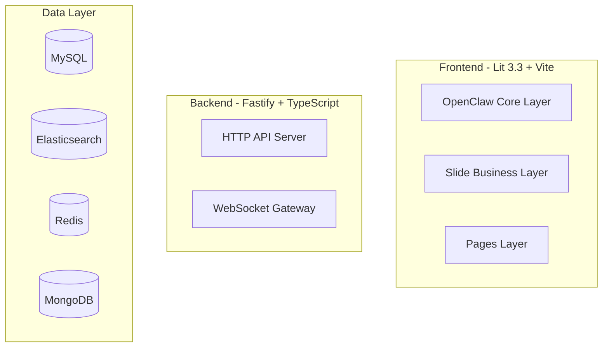

<objective>
创建 docs/slide/ 目录结构，清理 OpenClaw 上游文档，根据 D-03 整理根目录文件，编写 ARCHITECTURE.md 和 docs/slide/README.md。

Purpose: 建立清晰的文档目录结构，为后续文档提供基础设施，同时记录 Slide 系统的架构设计。
Output: docs/slide/ 目录（含 ARCHITECTURE.md、README.md）、干净的项目根目录和 docs/ 目录、正确放置的 tmp/ 文件。
</objective>

<execution_context>
@$HOME/.claude/get-shit-done/workflows/execute-plan.md
@$HOME/.claude/get-shit-done/templates/summary.md
</execution_context>

<context>
@.planning/PROJECT.md
@.planning/ROADMAP.md
@.planning/phases/94-project-documentation/94-CONTEXT.md
@.planning/phases/94-project-documentation/94-RESEARCH.md
@.planning/REQUIREMENTS.md

### Interfaces and Reference Context

**Key decision references (per CONTEXT.md):**
- D-01: Three core docs in `docs/slide/` subdirectory
- D-02: Delete all OpenClaw upstream docs (gateway/, plugins/, channels/, providers/, concepts/ etc. -- 70+ directories, ~229 .md files)
- D-03: Root file classification — keep CLAUDE.md, AGENTS.md, SOUL.md, IDENTITY.md, HEARTBEAT.md at root; move PROJECT_STRUCTURE.md to docs/slide/; move analysis_*.md, analysis-*.md, analysis_*.json, CONTRIBUTING.md, README.md, SECURITY.md, VISION.md, TOOLS.md, USER.md, SLIDE_FORK.md, SLIDE_REFACTOR_PLAN.md to tmp/
- D-04: All docs in Chinese
- D-05: Audience segmentation: ARCHITECTURE.md -> developers/architects
- D-06: ARCHITECTURE.md depth: high-level overview + system arch diagram + module summaries + data flow
- D-07: Mermaid/ASCII diagrams (GitHub-native rendering, use flowchart over graph)
- D-08: Standard sections: tech stack overview, system architecture diagram, module responsibilities, core data flow, external dependencies
- D-14: Exact directory structure for docs/slide/ (README.md, ARCHITECTURE.md, OPERATIONS.md, USER-GUIDE.md, PROJECT_STRUCTURE.md, assets/screenshots/)
- D-15: Maintenance strategy: sync-with-code, PR review checks docs

**Existing docs/ subdirectories to delete (OpenClaw upstream):**
.announcements, .channels, .clawhub, .cli, .concepts, .gateway, .help, .install, .plan, .plugins, .providers, .refactor, .reference, .security, .superpowers, .tools, .i18n

**Root-level files to keep:**
CLAUDE.md, AGENTS.md, SOUL.md, IDENTITY.md, HEARTBEAT.md, CHANGELOG.md, MEMORY.md, .markdownlint-cli2.jsonc

**Root-level files to move to tmp/:**
analysis_18204.md, analysis_18225.md, analysis_18247.md, analysis_18250.md, analysis_18266.json, analysis_18495.md, analysis_18509.md, analysis_18847.md, analysis_18857.md, analysis_18861.md, analysis_18869.md, analysis_18875.md, analysis_18888.md, analysis_18897.md, analysis_report_18865.md, analysis-18208.md, CONTRIBUTING.md, README.md, SECURITY.md, VISION.md, TOOLS.md, USER.md, SLIDE_FORK.md, SLIDE_REFACTOR_PLAN.md

**Root-level files to move to docs/slide/:**
PROJECT_STRUCTURE.md

**Source of truth files for ARCHITECTURE.md content:**
- apps/db-ops-api/server.ts — 3359 lines, all route registrations, startup sequence (DB init -> LLM -> Gateway -> monitor -> alert engine -> cron jobs)
- apps/db-ops-api/src/ — 40+ service modules listed in imports of server.ts
- apps/db-ops-api/package.json — fastify ^4.24.3, mysql2, @elastic/elasticsearch, ioredis, mongodb, pg, pdfkit, simple-statistics
- frontend/package.json — lit ^3.3.0, vite ^6.0.0, echarts, @codemirror/...
- apps/db-ops-api/src/gateway/openclaw-runtime.ts — OpenClaw config creation, agent defaults, tool allowlist, session config
- apps/db-ops-api/src/ai-agent-bridge.ts — dispatchOrReuse function (TTL-based caching, 4 analysis types)
- src/agents/system-prompt-config.ts — buildConfiguredAgentSystemPrompt
- apps/db-ops-api/src/gateway/ — 10 files: chat-methods.ts, config-service.ts, error-codes.ts, gateway-client.ts, openclaw-bridge.ts, openclaw-integration.test.ts, openclaw-runtime.ts, protocol.ts, server.ts, streaming.ts
- frontend/src/openclaw/ui/views/ — all frontend views
- SOUL.md — Slide identity and core positioning

**Existing Mermaid pattern (from CLAUDE.md / RESEARCH.md):**
Use `flowchart TB` with `subgraph` blocks for architecture diagrams.
Use `sequenceDiagram` for data flow.


**API endpoint groups (150 total):**
/api/health, /api/version, /api/auth/login, /api/users (CRUD), /api/database/instances (CRUD + execute + metrics + topsql + qan + explain + capacity + sessions), /api/llm/configs (CRUD + toggle + default + sync + test), /api/alerts (list + acknowledge + aggregate), /api/metrics (query + registry CRUD), /api/chat/history, /api/chat/greeting, /api/approval (submit + review + batch-review + pending + history), /api/reports (stats + CRUD + generate + download), /api/notification/channels (CRUD + test), /api/slow-queries, /api/schema (changes + tables), /api/index (collect + detect + list + redundancy + unused), /api/collector (start + stop), /api/dashboard (capacity-trend + ai-stats), /api/ai-analysis (config), /api/baseline (compute + schedule), /api/alerts/escalation (rules CRUD + check), /api/maintenance-windows (CRUD + check), /api/silence (CRUD + cleanup), /api/alerts/events (CRUD + assign + investigate + note + rca + resolve + close + postmortem + logs + mttr + search), /api/sql/audit, /api/sql/execution, /api/audit/log, /api/database-log
</interfaces>
</context>

<tasks>

<task type="auto">
  <name>Task 1: Create docs/slide/ directory structure and clean up files per D-02, D-03, D-14</name>
  <files>
    docs/slide/README.md
    docs/slide/PROJECT_STRUCTURE.md
    docs/slide/assets/screenshots/.gitkeep
    docs/ (bulk delete of OpenClaw upstream files)
    tmp/ (move upstream root files)
    .gitignore (add tmp/ to ignore if not present)
  </files>
  <read_first>
    .planning/phases/94-project-documentation/94-CONTEXT.md (D-02, D-03, D-14)
    docs/PROJECT_STRUCTURE.md (file to move)
    .gitignore (to add tmp/ entry)
  </read_first>
  <action>
    按 D-02 清理 docs/ 目录：删除 docs/ 下除 PROJECT_STRUCTURE.md 之外的所有文件和子目录（含 .DS_Store、.i18n 等隐藏内容）。目标：docs/ 目录只保留 PROJECT_STRUCTURE.md。删除内容包括但不限于 announcements/, channels/, clawhub/, cli/, concepts/, gateway/, help/, install/, plan/, plugins/, providers/, refactor/, reference/, security/, superpowers/, tools/, .i18n/, assets/, fault-diagnosis-18259.md, MIGRATION_COMPLETE.md, openclaw-fork.md, README.md, .DS_Store。

    按 D-03 整理根目录文件：
    - 将 PROJECT_STRUCTURE.md 从 docs/ 移到 docs/slide/PROJECT_STRUCTURE.md（若目录不存在则先创建）
    - 将 analysis_*.md、analysis-*.md、analysis_*.json（共 16 个文件）、CONTRIBUTING.md、README.md、SECURITY.md、VISION.md、TOOLS.md、USER.md、SLIDE_FORK.md、SLIDE_REFACTOR_PLAN.md 从根目录移到 tmp/（若 tmp/ 中已有 analysis_18990.md 则合并）
    - 不移动根目录的：CLAUDE.md、AGENTS.md、SOUL.md、IDENTITY.md、HEARTBEAT.md、CHANGELOG.md、MEMORY.md、.gitignore、.markdownlint-cli2.jsonc

    按 D-14 创建目录结构：
    ```
    docs/slide/
    ├── README.md
    ├── ARCHITECTURE.md
    ├── OPERATIONS.md
    ├── USER-GUIDE.md
    ├── PROJECT_STRUCTURE.md
    └── assets/
        └── screenshots/
            └── .gitkeep
    ```
    创建 assets/screenshots/.gitkeep 以保留空目录。

    创建 docs/slide/README.md（导航索引）：
    - 中文编写（D-04）
    - 标题："Slide 项目文档"
    - 包含四个部分：
      1. 项目概述（2-3 句介绍 Slide 是什么）
      2. 文档索引（链接到 ARCHITECTURE.md、OPERATIONS.md、USER-GUIDE.md、PROJECT_STRUCTURE.md，每个加 1 句说明）
      3. 快速入门（CLAUDE.md 中的启动命令参考：`cd apps/db-ops-api && npx tsx server.ts`、`cd frontend && npm run dev`）
      4. 文档维护（按 D-15 说明：功能变更时同步更新对应文档、PR review 检查文档）

    如果 .gitignore 中还没有 `tmp/` 条目，追加一行 `tmp/`。

    操作时检查是否还有 docs/ 根目录下的残留文件（find docs/ -type f），只允许 docs/slide/ 下的内容存在。使用 ls 验证每个移动/删除步骤的结果。
  </action>
  <verify>
    <automated>
      test -d docs/slide && test -d docs/slide/assets/screenshots && test -f docs/slide/PROJECT_STRUCTURE.md && test -f docs/slide/README.md && echo "STRUCTURE OK"
      find docs/ -type f -not -path 'docs/slide/*' | wc -l | xargs echo "Remaining non-slide docs files:"
      ls tmp/analysis_* 2>/dev/null | wc -l | xargs echo "Analysis files in tmp:"
      test -f tmp/README.md && echo "README moved to tmp" || echo "WARN: README.md not in tmp"
      test -f CLAUDE.md && test -f AGENTS.md && test -f SOUL.md && test -f IDENTITY.md && test -f HEARTBEAT.md && echo "ROOT KEPT OK"
      test ! -f analysis_18204.md && echo "ROOT CLEAN OK"
      grep -q 'tmp/' .gitignore 2>/dev/null && echo "GITIGNORE OK"
    </automated>
  </verify>
  <acceptance_criteria>
    1. `ls docs/slide/` 输出包含 ARCHITECTURE.md, README.md, OPERATIONS.md, USER-GUIDE.md, PROJECT_STRUCTURE.md, assets/
    2. `find docs/ -type f -not -path 'docs/slide/*'` 输出为空（无残留文件）
    3. `ls tmp/analysis_18204.md` 文件存在（已移入 tmp/）
    4. `ls tmp/README.md` 文件存在（已移入 tmp/）
    5. `ls CLAUDE.md AGENTS.md SOUL.md IDENTITY.md HEARTBEAT.md` 全部存在
    6. `grep 'tmp/' .gitignore` 有匹配行
  </acceptance_criteria>
</task>

<task type="auto">
  <name>Task 2: Write ARCHITECTURE.md with Mermaid diagrams</name>
  <files>
    docs/slide/ARCHITECTURE.md
  </files>
  <read_first>
    apps/db-ops-api/server.ts (lines 1-120 for imports and startup, lines 3044-3049 for gateway startup, lines 3051-3067 for service startup)
    apps/db-ops-api/src/gateway/openclaw-runtime.ts (full file for Gateway config)
    apps/db-ops-api/src/ai-agent-bridge.ts (full file for AI analysis architecture)
    apps/db-ops-api/package.json (dependencies list for tech stack)
    frontend/package.json (dependencies list for tech stack)
    docs/PROJECT_STRUCTURE.md (directory tree and architecture layers for reference)
    .planning/PROJECT.md (architecture overview and key capabilities)
    .planning/phases/94-project-documentation/94-RESEARCH.md (Mermaid pattern examples, arch pattern guidance)
    SOUL.md (Slide identity/core positioning for intro section)
  </read_first>
  <action>
    编写 docs/slide/ARCHITECTURE.md，全部使用中文（D-04），目标受众为技术团队/开发者/架构师（D-05）。

    文档结构按 D-08 要求，分以下章节：

    1. **# Slide 系统架构**
       - 开篇 2-3 段介绍 Slide 定位："AI 原生的数据库运维平台"，基于 OpenClaw Agent 框架，集成 LLM 实现自动化运维。引用 SOUL.md 的核心定位。

    2. **## 技术栈总览**
       - 用表格列出各层技术栈：
         | 层 | 技术 | 版本 | 用途 |
         |---|------|------|------|
         | 前端框架 | Lit | ^3.3.0 | Web Components |
         | 构建工具 | Vite | ^6.0.0 | 开发/构建 |
         | 后端框架 | Fastify | ^4.24.3 | HTTP API |
         | 图表 | ECharts | - | 仪表盘/可视化 |
         | 代码编辑器 | CodeMirror | ^6.x | SQL 控制台 |
         | AI Gateway | OpenClaw | - | 原生 LLM 流式通信 |
         | 主数据库 | MySQL 8 | mysql2 ^3.20.0 | 业务数据存储 |
         | 搜索 | Elasticsearch | @elastic/elasticsearch ^8.11.0 | 日志/分析 |
         | 缓存 | Redis | ioredis ^5.3.2 | 会话/缓存 |
         | 文档 | MongoDB | mongodb ^6.3.0 | 柔性数据 |
         | LLM | Anthropic/OpenAI/Ollama | Anthropic SDK, OpenAI SDK | AI 分析 |
         | 报表 | PDFKit | ^0.18.0 | PDF 报表生成 |
       - 来源：apps/db-ops-api/package.json, frontend/package.json

    3. **## 系统架构图**
       - 使用 Mermaid flowchart TB，包含至少 4 个 subgraph：前端、后端、数据层、AI/LLM 层
       - 展示前端（Lit + Vite） -> WebSocket -> OpenClaw Gateway (28789) 和 REST -> Fastify API (3000)
       - 展示 Fastify -> MySQL / Elasticsearch / Redis / MongoDB
       - 展示 Gateway -> Anthropic / OpenAI / Ollama
       - 参考 RESEARCH.md 中的 Mermaid 示例模式

    4. **## 模块职责**
       - 按 apps/db-ops-api/src/ 中实际存在的模块列，每个模块写 2-3 句职责说明：
         - **数据库连接管理** (db-connection.ts) — 系统数据库连接池初始化
         - **实例管理** (instance-database-service.ts) — 数据库实例 CRUD、连接测试、状态管理
         - **认证与权限** (auth-database-service.ts, auth/) — JWT 认证、RBAC 权限体系（角色/权限点/用户绑定/实例级访问控制）
         - **LLM 管理** (llm-database-service.ts, llm-service.ts, llm/) — LLM 提供商配置管理、多模型切换、密钥加密存储
         - **告警管理** (alert-database-service.ts, alert-engine.ts, alert-*) — 告警规则评估（每 60 秒）、事件管理、升级规则、静默规则、维护窗口
         - **指标采集** (monitor-collector.ts, metrics-database-service.ts) — 30 秒间隔指标采集、历史存储
         - **AI 分析** (ai-agent-bridge.ts, ai-analysis-*.ts, topsql-analysis-service.ts, alert-rca-service.ts, fault-diagnosis-service.ts) — RCA 根因分析、TopSQL 分析、故障诊断、TTL 缓存
         - **SQL 审核** (sql-audit-service.ts) — AI 驱动的 SQL 预执行审核与风险检测
         - **SQL 执行** (sql-executor.ts) — SQL 执行引擎（只读/受控）
         - **系统/表结构** (schema-*.ts, index-*.ts) — 表结构变更追踪、索引管理（冗余/未使用检测）
         - **报表** (report-*.ts) — 健康检查/性能/慢查询/容量报表生成与导出（PDF/HTML/JSON/MD）
         - **通知** (notification-*.ts) — 多渠道通知（钉钉/企微/飞书/Webhook）、SSRF 防护
         - **基线预测** (baseline-calculator.ts, capacity-predictor.ts) — 指标基线计算、容量线性回归预测
         - **Gateway 运行时** (gateway/openclaw-runtime.ts) — OpenClaw Agent 配置、对话分发、工具执行
         - **前端视图** (frontend/src/openclaw/ui/views/) — 仪表盘、实例详情、告警列表、SQL 控制台、Chat、审批、RBAC、报表、AI 设置、Schema 管理
       - 每个模块标注对应的源码目录或文件名

    5. **## 核心数据流**
       - 使用 Mermaid sequenceDiagram 展示主要数据流：
         a. 用户请求流程（浏览器 -> Frontend -> REST/Gateway -> Backend -> Database -> Response）
         b. AI 分析流程（Alert/Manual Trigger -> ai-agent-bridge -> Gateway RPC -> LLM -> Result Persist -> Display）
         c. 监控采集流程（CronJob -> monitor-collector -> metricsDatabaseService -> DB Store）
         d. 告警评估流程（CronJob 60s -> alertEngine.evaluate() -> 检查规则 -> 生成告警 -> 通知推送）
       - sequenceDiagram 各图需标注端口号（3000, 5173, 28789）

    6. **## 外部依赖**
       - 表格列出所有外部依赖（数据库、LLM 提供商、构建工具）
       - 每行列：依赖名、用途、配置项

    7. **## 架构决策记录**
       - 从 .planning/PROJECT.md 提取关键决策：
         - 复用 OpenClaw Agent 框架（而非自建 AI 管道）
         - ai-agent-bridge 统一派发 + TTL 缓存
         - Gateway 原生 WS 通信（非 REST polling）
         - JWT + RBAC 三层权限体系
         - 参数化查询防注入

    文档要求：
    - 全文中文（D-04）
    - Mermaid 图使用 flowchart 而非 graph（D-07 + RESEARCH.md 建议）
    - 不复制大段代码，引用文件路径（D-15 防 drift）
    - 每个 Mermaid 图在 GitHub 渲染兼容（避免复杂 styling 和 unicode 特殊字符）
    - 保持高层面，每模块 2-3 句

    最后运行 `npx markdownlint-cli2 docs/slide/ARCHITECTURE.md` 验证 lint 通过。
  </action>
  <verify>
    <automated>
      test -f docs/slide/ARCHITECTURE.md && echo "FILE EXISTS"
      grep -c 'mermaid' docs/slide/ARCHITECTURE.md | xargs echo "MERMAID DIAGRAMS:"
      grep -c 'sequenceDiagram' docs/slide/ARCHITECTURE.md | xargs echo "SEQUENCE DIAGRAMS:"
      grep -q '技术栈' docs/slide/ARCHITECTURE.md && echo "TECH STACK OK"
      grep -q '模块职责' docs/slide/ARCHITECTURE.md && echo "MODULES OK"
      grep -q '核心数据流' docs/slide/ARCHITECTURE.md && echo "DATA FLOW OK"
      grep -q '外部依赖' docs/slide/ARCHITECTURE.md && echo "DEPS OK"
      npx markdownlint-cli2 docs/slide/ARCHITECTURE.md 2>/dev/null && echo "LINT PASSED" || echo "LINT ISSUES"
    </automated>
  </verify>
  <acceptance_criteria>
    1. 文件 docs/slide/ARCHITECTURE.md 存在且非空（>2000 字符）
    2. 包含至少 2 个 Mermaid 代码块（1 个 flowchart、1 个 sequenceDiagram）
    3. 包含以下章节标题：技术栈总览、系统架构图、模块职责、核心数据流、外部依赖
    4. 包含至少 10 个模块的职责说明（引自 apps/db-ops-api/src/ 下的实际模块）
    5. markdownlint-cli2 通过（$? = 0）
  </acceptance_criteria>
</task>

</tasks>

<threat_model>
## Trust Boundaries

| Boundary | Description |
|----------|-------------|
| Documentation | This is a documentation-only plan with no code changes, runtime config, or deployment modifications. No trust boundaries apply. |
</threat_model>

<verification>
1. `docs/slide/` 目录结构存在且完整
2. `find docs/ -type f` 仅显示 docs/slide/ 下的文件
3. 根目录分析文件已移入 tmp/
4. ARCHITECTURE.md 文件名、章节、Mermaid 图、模块覆盖符合 D-06~D-08 要求
5. `npx markdownlint-cli2 docs/slide/ARCHITECTURE.md` 通过
6. docs/slide/README.md 提供指向三个核心文档的导航链接
</verification>

<success_criteria>
1. docs/slide/ARCHITECTURE.md 已创建，包含 Mermaid 架构图和数据流图
2. docs/ 只包含 docs/slide/ 子目录及其内容
3. 根目录上游文件和分析文件已移入 tmp/
4. CLAUDE.md、AGENTS.md、SOUL.md、IDENTITY.md、HEARTBEAT.md 保留在根目录
5. docs/slide/README.md 提供完整的文档导航
6. markdownlint 对 ARCHITECTURE.md 通过
</success_criteria>

<output>
After completion, create `.planning/phases/94-project-documentation/94-01-SUMMARY.md`
</output>
