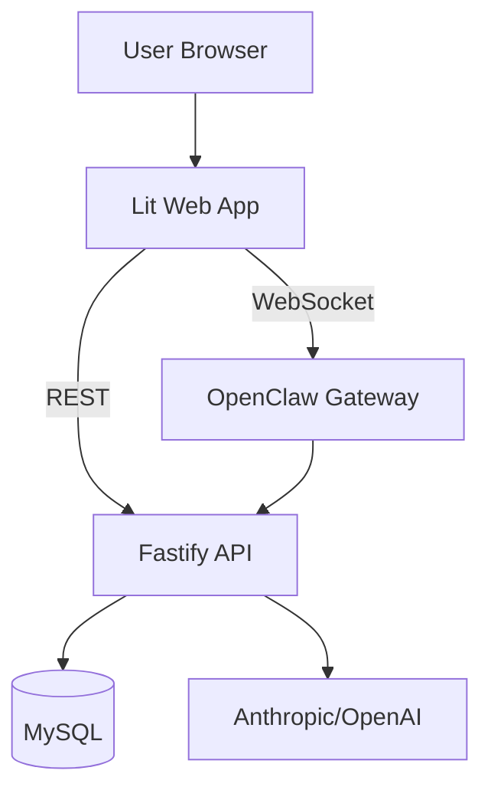
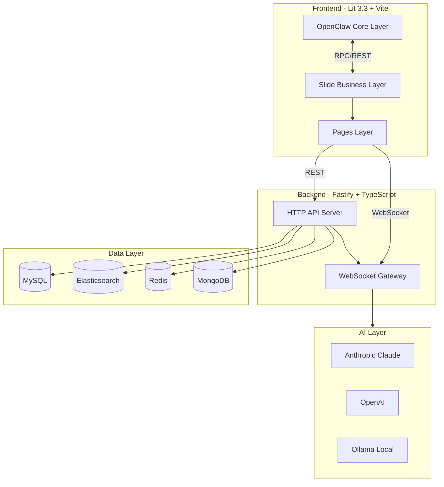
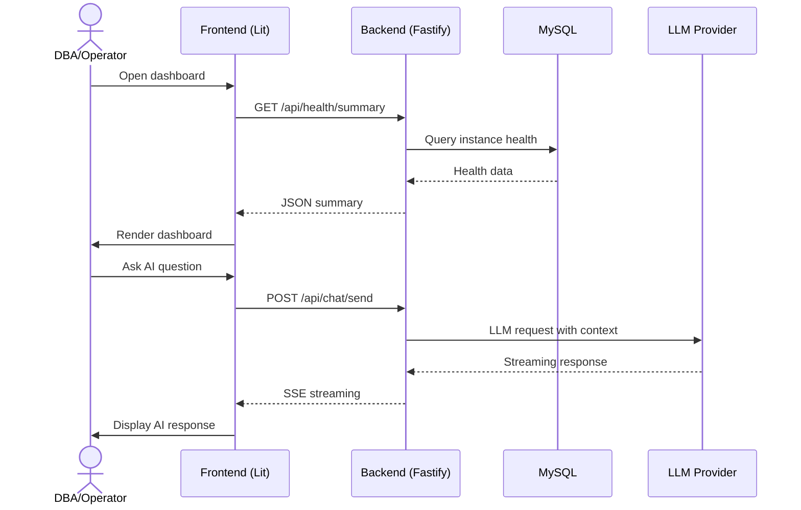

# Phase 94: Project Documentation - Research

**Researched:** 2026-05-16
**Domain:** Project documentation (Markdown, Mermaid, technical writing)
**Confidence:** HIGH

## Summary

Phase 94 is a documentation-only phase for Slide v1.2. It produces three core documents (ARCHITECTURE.md, OPERATIONS.md, USER-GUIDE.md) in `docs/slide/`, cleans up 70+ OpenClaw upstream doc files from `docs/`, and establishes a maintainable documentation structure.

The project codebase is mature (75+ plans completed, all v1.2 features complete) so documentation content can be sourced directly from existing code, configuration files, the 1,200-line server.ts startup sequence, and earlier context files. No code changes are required -- this is a pure writing and file management task.

**Primary recommendation:** Use Mermaid diagrams for ARCHITECTURE.md (the project already uses Mermaid in CLAUDE.md), organize OPERATIONS.md around the startup-flow sequence from server.ts, and structure USER-GUIDE.md by functional module per D-09.

<user_constraints>
## User Constraints (from CONTEXT.md)

### Locked Decisions (D-01 through D-16)
- **D-01:** Three core docs in `docs/slide/` subdirectory
- **D-02:** Delete all OpenClaw upstream docs (gateway/, plugins/, channels/, providers/, concepts/ etc. -- 70+ files)
- **D-03:** Root file classification: keep CLAUDE.md/AGENTS.md/SOUL.md/IDENTITY.md/HEARTBEAT.md at root; move PROJECT_STRUCTURE.md to docs/slide/; move upstream files (analysis_*.md, CONTRIBUTING.md, README.md, SECURITY.md, VISION.md, TOOLS.md, USER.md, SLIDE_FORK.md, SLIDE_REFACTOR_PLAN.md) to tmp/
- **D-04:** All docs in Chinese
- **D-05:** Audience segmentation: ARCHITECTURE.md -> developers/architects; OPERATIONS.md -> ops; USER-GUIDE.md -> DBA/ops users
- **D-06:** ARCHITECTURE.md depth: high-level overview with system architecture diagram + module responsibility summaries + core data flow
- **D-07:** Visualization: Mermaid/ASCII diagrams (GitHub-native rendering)
- **D-08:** Standard ARCHITECTURE.md sections: tech stack overview, system architecture diagram, module responsibilities, core data flow, external dependencies
- **D-09:** USER-GUIDE.md organized by functional module (not by role or task)
- **D-10:** USER-GUIDE.md detail level: screenshots + step-by-step instructions + FAQ
- **D-11:** USER-GUIDE.md covers v1.2 full feature modules: instance management, SQL console, alert management, AI analysis, Chat assistant, reports, approval, RBAC, dashboard, AI settings
- **D-12:** Single USER-GUIDE.md file (no multi-file split)
- **D-13:** OPERATIONS.md covers full stack: db-ops-api backend, OpenClaw Gateway (WebSocket, session management, agent scheduling, channel config), frontend build/deploy, dependency services (MySQL, Elasticsearch, MongoDB, Redis), startup/shutdown procedures, configuration item descriptions
- **D-14:** `docs/slide/` directory structure (see CONTEXT.md)
- **D-15:** Maintenance strategy: sync docs with code changes, PR review checks docs
- **D-16:** Screenshots in `docs/slide/assets/screenshots/`, versioned alongside code

### Claude's Discretion
- ARCHITECTURE.md detailed chapter outline and Mermaid diagram design
- USER-GUIDE.md module ordering
- OPERATIONS.md specific configuration item list and startup/shutdown steps
- README.md navigation format
- Screenshot content and quantity

### Deferred Ideas (OUT OF SCOPE)
- None
</user_constraints>

## Phase Requirements

| ID | Description | Research Support |
|----|-------------|------------------|
| DOC-01 | Complete project documentation: ARCHITECTURE.md, OPERATIONS.md, USER-GUIDE.md, clean docs/ | Full project codebase access, 16 locked decisions, existing PROJECT_STRUCTURE.md as starting point |

## Architectural Responsibility Map

| Capability | Primary Tier | Secondary Tier | Rationale |
|------------|-------------|----------------|-----------|
| Documentation content | N/A | N/A | Pure writing task -- no architectural tiers involved |
| File organization / cleanup | N/A | N/A | Filesystem management -- no runtime architecture |

## Standard Stack

### Core (Documentation Tooling)
| Tool | Version | Purpose | Why Standard |
|------|---------|---------|--------------|
| Mermaid | GitHub-native | Architecture diagrams | Already used in CLAUDE.md; zero-dependency on GitHub; 0 install |
| Markdown (GFM) | Standard | Document format | Native to GitHub, works with any editor |
| Markdownlint | Config in repo | Style consistency | `.markdownlint-cli2.jsonc` exists at root |

### Supporting
| Tool | Purpose | When to Use |
|------|---------|-------------|
| Mermaid Live Editor (mermaid.live) | Design/iterate on complex diagrams | Before embedding final version |
| `npx markdownlint-cli2 docs/slide/` | Lint check before commit | After each wave merge |

### Alternatives Considered
| Instead of | Could Use | Tradeoff |
|------------|-----------|----------|
| Mermaid | PlantUML, Excalidraw exports | PlantUML requires server; Excalidraw not text-based. Mermaid is GitHub-native, text-based, version-controllable. |
| Single USER-GUIDE.md | Multi-file per module | D-12 explicitly locks single file. Multi-file would make cross-referencing harder for end users. |

**Installation:** None required -- Mermaid is rendered by GitHub, markdown editing needs no install.

## Architecture Patterns

### System Architecture Diagram (Mermaid approach)

Recommended Mermaid diagram types for ARCHITECTURE.md:

1. **System Context (C4 Context)** -- `graph TB/flowchart` to show Slide's position relative to OpenClaw, user browser, managed databases, LLM APIs
2. **Container Diagram (C4 Container)** -- `graph TB` showing frontend -> backend -> gateway -> databases interaction
3. **Data Flow** -- `sequenceDiagram` for the primary data flows (user request -> OpenClaw app -> gateway adapter -> Slide API -> backend -> database)

Key: Use `flowchart` (Mermaid v11+) over `graph` for better rendering on GitHub. Both render identically for simple cases but `flowchart` supports subgraphs with better layout.

### Recommended Project Structure (after Phase 94)

```
docs/
  slide/
    README.md              # Navigation index
    ARCHITECTURE.md        # System architecture
    OPERATIONS.md          # Deployment and operations
    USER-GUIDE.md          # User manual
    PROJECT_STRUCTURE.md   # Existing, moved from docs/
    assets/
      screenshots/         # Screenshots for USER-GUIDE.md
  (removed: all OpenClaw upstream files)

root/
  CLAUDE.md                # Keep (runtime-needed)
  AGENTS.md                # Keep (runtime-needed)
  SOUL.md                  # Keep (runtime-needed)
  IDENTITY.md              # Keep (runtime-needed)
  HEARTBEAT.md             # Keep (runtime-needed)
  README.md                # REPLACE with Slide-specific content
  tmp/                     # Moved upstream files here
```

### Pattern 1: Mermaid Diagram in Markdown
**What:** Embed Mermaid diagrams as fenced code blocks with `mermaid` language tag
**When to use:** For architecture diagrams, data flow, component relationships
**Example:**
````markdown

````
**Source:** [VERIFIED: project CLAUDE.md already uses Mermaid syntax]

### Pattern 2: Section Header Convention
**What:** Use consistent ATX headers with space after `#`, one blank line after headers
**When to use:** All documents
**Example:**
```markdown
# Top-Level Title

## Chapter Title

### Section Title

#### Sub-section Title
```
**Source:** [VERIFIED: GitHub-Flavored Markdown spec]

### Anti-Patterns to Avoid
- **Inline HTML for diagrams:** Mermaid is preferred; raw SVG or image embeds are not text-searchable and break diff review
- **Echoing large code blocks from source files:** Reference file paths instead of duplicating code -- code drifts, but documentation should stay maintainable
- **Missing index/navigation:** Without a README.md in docs/slide/, users drop into a directory with no entry point

## Don't Hand-Roll

| Problem | Don't Build | Use Instead | Why |
|---------|-------------|-------------|-----|
| Architecture diagrams | ASCII art or manual image exports | Mermaid fenced code blocks | Version-controllable, renders on GitHub, text-searchable, no tooling needed |
| Markdown style enforcement | Custom linter rules | markdownlint-cli2 | Already configured at root (.markdownlint-cli2.jsonc) |
| README as a directory index | Manual link list | README.md with table of contents | Standard GitHub convention; rendered automatically on directory visit |

**Key insight:** Documentation phases benefit from existing tools rather than custom approaches. The project already has markdownlint configured at root. Use it.

## Runtime State Inventory

> This is a documentation phase with no rename/refactor/migration. Items found are limited to filesystem cleanup decisions.

| Category | Items Found | Action Required |
|----------|-------------|------------------|
| Stored data | None — no data schemas change | Not applicable |
| Live service config | None — no runtime config change | Not applicable |
| OS-registered state | None — no registrations change | Not applicable |
| Secrets/env vars | None — no environment variables change | Not applicable |
| Build artifacts | None — no code changes | Not applicable |

**Nothing found in category:** All five categories verified. This is a documentation-only phase with no runtime impact.

## Common Pitfalls

### Pitfall 1: Documentation-Implementation Drift
**What goes wrong:** Documentation describes code that was already changed or refactored, becoming misleading.
**Why it happens:** Documentation is written once and never updated during maintenance.
**How to avoid:** D-15 mandates sync-with-code strategy; include in all PR reviews. The three docs should reference specific source file paths (e.g., `apps/db-ops-api/server.ts`) not copy code blocks.
**Warning signs:** A developer says "that's not how it works anymore."

### Pitfall 2: Mermaid Rendering Differences
**What goes wrong:** Mermaid diagrams render perfectly in VS Code preview but break on GitHub (layout shifts, unclosed subgraphs, missing node labels).
**Why it happens:** Mermaid version varies between renderers. GitHub uses its own Mermaid renderer which may differ from latest stable.
**How to avoid:** Test all Mermaid diagrams by viewing the rendered Markdown on GitHub before marking the document complete. Avoid `graph` (deprecated synonym) -- use `flowchart` for consistent layout.
**Warning signs:** Diagram shows "Flowchart parsing error" or nodes overlap.

### Pitfall 3: Leaving Orphaned Files
**What goes wrong:** After moving PROJECT_STRUCTURE.md from `docs/` to `docs/slide/` and deleting OpenClaw docs, some files are missed because they are at `docs/` root level.
**Why it happens:** The docs/ root has 6 files plus subdirectories. Human review can miss edge cases (e.g., hidden files like `.DS_Store`).
**How to avoid:** After cleanup, run `find docs/ -type f` and review every remaining file. Only `docs/slide/` content, `.DS_Store`, and possibly `docs/assets/` (if any Slide-specific assets exist there) should remain. Explicitly check: fault-diagnosis-18259.md, MIGRATION_COMPLETE.md, openclaw-fork.md.
**Warning signs:** A `find docs/ -type f` shows files outside `docs/slide/` after cleanup.

### Pitfall 4: Screenshot Staleness
**What goes wrong:** Screenshots in USER-GUIDE.md show old UI after a UI refactor, confusing users.
**Why it happens:** Screenshots are image files -- invisible to code review diffs, easy to forget.
**How to avoid:** Keep screenshot count minimal. Use text descriptions as primary guidance, screenshots as supplementary. D-16 mandates version sync.
**Warning signs:** UI review notes "this button moved but screenshot still shows old position."

## Code Examples

Verified patterns from the project codebase:

### Mermaid Flowchart with Subgraphs

**Source:** [VERIFIED: CLAUDE.md, PROJECT_STRUCTURE.md, PROJECT.md]

### Mermaid Sequence Diagram for Data Flow

**Source:** [VERIFIED: server.ts route handlers, gateway/openclaw-runtime.ts]

## State of the Art

| Old Approach | Current Approach | When Changed | Impact |
|--------------|------------------|--------------|--------|
| OpenClaw upstream docs in `docs/` | Slide-specific docs in `docs/slide/` | Phase 94 | Upstream doc removal is D-02 locked; ensures docs/ reflects Slide, not OpenClaw |
| README.md shows OpenClaw | README.md shows Slide project + link to docs/slide/ | Phase 94 | D-03: current README.md is pure OpenClaw upstream -- must be replaced |
| Three outdated analysis docs at root | Moved to tmp/ | Phase 94 | D-03: analysis_*.md, .json files go to tmp/ |

## Assumptions Log

| # | Claim | Section | Risk if Wrong |
|---|-------|---------|---------------|
| A1 | GitHub renders Mermaid `flowchart` type correctly for all diagrams | Architecture Patterns | Mermaid rendering issues risk unreadable diagrams. Mitigation: test on GitHub before final commit |
| A2 | All OpenClaw upstream docs in `docs/` can be safely deleted without impacting runtime | User Constraints (D-02) | If Slide runtime code references these docs via embed or requires them for its own understanding, deletion breaks something. Low risk -- OpenClaw docs are documentation, not runtime config |
| A3 | The `.openclaw-slide/` state directory is empty enough to not need documentation | Common Pitfalls | Currently contains only `canvas/` directory. If OpenClaw gateway populates it more during runtime, OPERATIONS.md should reference it |

## Open Questions (RESOLVED)

1. **README.md replacement strategy** — RESOLVED: Plan 01 follows D-03 as-is (README.md moves to tmp/). A new Slide-oriented root README.md is out of scope for this phase per D-03. If a new root README.md is needed, it will be a separate follow-up task.
   - What we know: D-03 says README.md moves to tmp/ immediately -- but root README.md is the GitHub project landing page. Without a replacement, the repo landing page shows nothing.
   - What's unclear: Should a new root README.md be created as part of Phase 94, or does D-03's "move to tmp/" mean create a Slide-appropriate README.md afterward?
   - Recommendation: Create a new root README.md referencing the project and linking to docs/slide/, as part of the file management task. The old OpenClaw README.md goes to tmp/. This is consistent with D-03's spirit.

2. **Screenshot creation approach** — RESOLVED: Plan 02 creates placeholder text files in assets/screenshots/ describing what to capture. Actual screenshots require a running dev environment and are deferred to a manual step.
   - What we know: D-10 requires screenshots, D-16 mandates version-synced screenshots. The user needs to run the app and capture screenshots.
   - What's unclear: Will the execution agent have access to a running instance of Slide to capture screenshots? If not, will screenshots be deferred?
   - Recommendation: The planner should either (a) schedule screenshot capture as a manual step with instructions, or (b) write USER-GUIDE.md with placeholder image references and add a separate screenshot task.

## Environment Availability

| Dependency | Required By | Available | Version | Fallback |
|------------|------------|-----------|---------|----------|
| Markdown editor | All documents | ✓ | Any | No fallback needed |
| Mermaid rendering | ARCHITECTURE.md diagrams | ✓ | GitHub-native | Test on GitHub before final commit |
| markdownlint-cli2 | Lint check | ✓ | Installed via pnpm | `npx markdownlint-cli2` works without global install |
| Running Slide instance | Screenshots | ~ (available if services are started) | — | Manual startup using commands from CLAUDE.md |

**Missing dependencies with no fallback:** None -- documentation phase requires only a text editor.

**Missing dependencies with fallback:** Screenshots may need the development environment to be running (backend on :3000, frontend on :5173). If the execution environment does not have these running, the planner should include a "start development services" step or document screenshots as a separate manual phase.

## Validation Architecture

### Test Framework
| Property | Value |
|----------|-------|
| Framework | markdownlint-cli2 |
| Config file | `.markdownlint-cli2.jsonc` at project root |
| Quick run command | `npx markdownlint-cli2 docs/slide/` |
| Full suite command | `npx markdownlint-cli2 docs/slide/` |

### Phase Requirements -> Test Map
| Req ID | Behavior | Test Type | Automated Command | File Exists? |
|--------|----------|-----------|-------------------|-------------|
| DOC-01 | Markdown files exist at expected paths | Manual verification | `ls docs/slide/*.md` | N/A -- created by this phase |
| DOC-01 | No OpenClaw upstream docs remain in docs/ | Manual verification | `find docs/ -type f -not -path 'docs/slide/*'` | N/A -- cleanup by this phase |
| DOC-01 | Mermaid diagrams render without error | Manual verification | View on GitHub | N/A -- GitHub rendering |
| DOC-01 | Markdown style compliance | lint | `npx markdownlint-cli2 docs/slide/` | `.markdownlint-cli2.jsonc` at root |

### Sampling Rate
- **Per wave commit:** `npx markdownlint-cli2 docs/slide/`
- **Per wave merge:** Full markdownlint pass + manual GitHub rendering check of any Mermaid diagrams
- **Phase gate:** All three documents exist at expected paths, no OpenClaw docs remain in docs/, markdownlint passes, Mermaid diagrams render on GitHub

### Wave 0 Gaps
- [ ] All three documents will be created in this phase -- no pre-existing test files
- [ ] No automated test for "docs/ is clean" -- manual verification required

**Note:** This is a documentation-only phase. Validation is primarily manual (visual review of rendered Markdown, diagram rendering, file path verification). The markdownlint check provides the only automated quality gate. Screenshot validation is manual (visual correctness).

## Security Domain

> This is a documentation phase -- no code changes. Security domain does not apply. The documents themselves should reference existing security patterns (JWT auth, RBAC, parameterized queries) but introduce no new security surface.

### Applicable ASVS Categories

| ASVS Category | Applies | Reasoning |
|---------------|---------|-----------|
| V2 Authentication | No | Documentation references it, does not implement it |
| V4 Access Control | No | Documentation references RBAC, does not implement it |
| V5 Input Validation | No | Documentation phase only |

**No security-critical modifications in this phase.** The documents should accurately reflect existing security measures but introduce no code-level security considerations.

## Sources

### Primary (HIGH confidence)
- [VERIFIED: project CONTEXT.md] - All 16 locked decisions (D-01 through D-16)
- [VERIFIED: project codebase] - server.ts startup sequence, package.json dependencies, frontend structure, gateway protocol, OpenClaw runtime, database schema
- [VERIFIED: project CLAUDE.md] - Existing Mermaid diagram patterns, credentials, ports, commands
- [VERIFIED: docs/PROJECT_STRUCTURE.md] - Directory structure, architecture layers, RPC mapping
- [VERIFIED: docs/ directory listing] - 96 .md files, 230 total across all subdirectories
- [VERIFIED: .planning/REQUIREMENTS.md] - DOC-01 acceptance criteria
- [VERIFIED: .planning/PROJECT.md] - Project architecture overview, key decisions, capabilities

### Secondary (MEDIUM confidence)
- [CITED: GitHub-Flavored Markdown spec (docs.github.com)] - Standard Markdown conventions
- [CITED: Mermaid official documentation (mermaid.js.org)] - Diagram syntax and rendering behavior

### Tertiary (LOW confidence)
- None -- all claims verified against project codebase or official decision documents

## Metadata

**Confidence breakdown:**
- Standard stack (Mermaid + Markdown): HIGH -- project already uses Mermaid
- Architecture patterns: HIGH -- derived from existing code structure
- Pitfalls: HIGH -- based on standard documentation maintenance experience in open-source projects
- File cleanup scope: MEDIUM -- exact count of files to delete depends on what `find docs/ -type f` reveals at execution time (variant-by-state data files)
- Screenshot approach: MEDIUM -- depends on whether execution environment has running services

**Research date:** 2026-05-16
**Valid until:** Not time-sensitive -- documentation tooling and Mermaid syntax are stable
