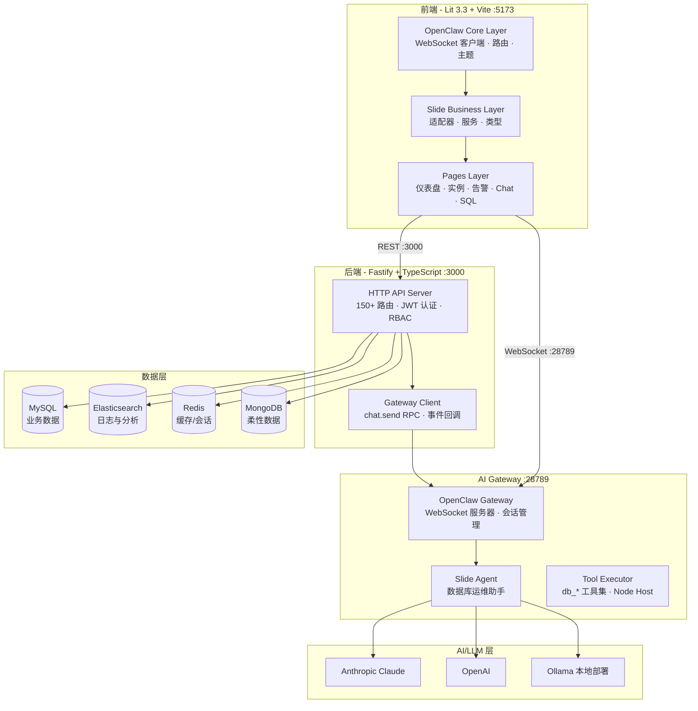
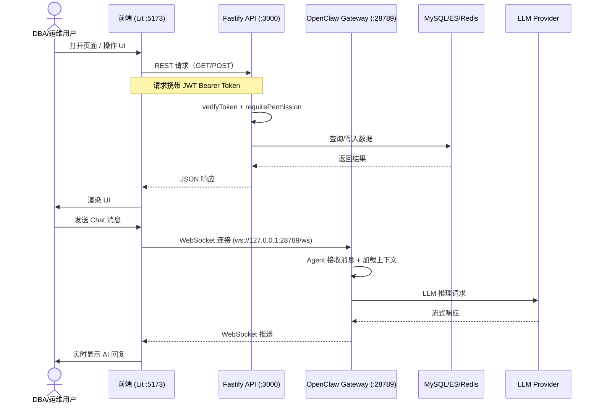
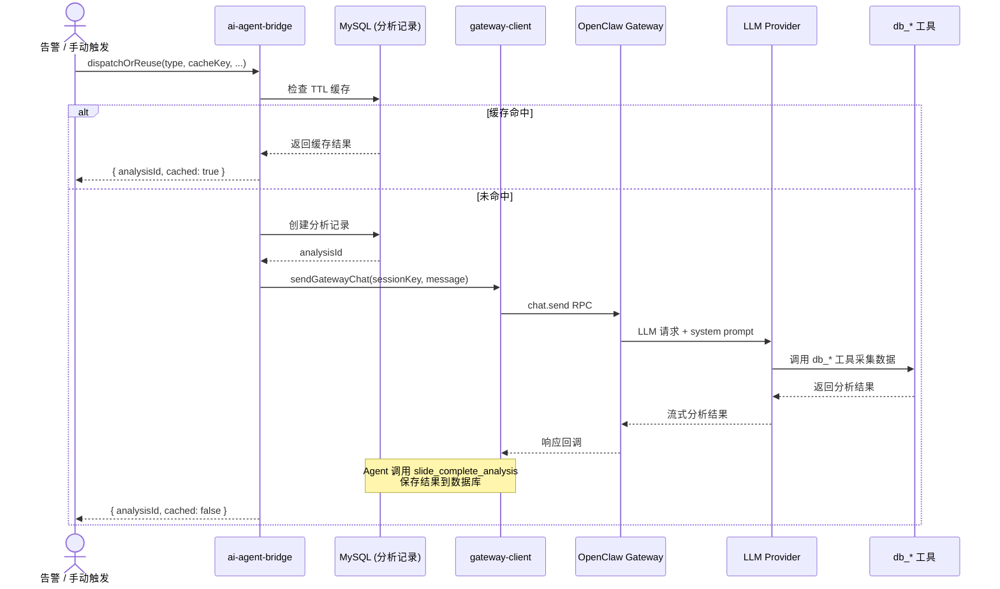
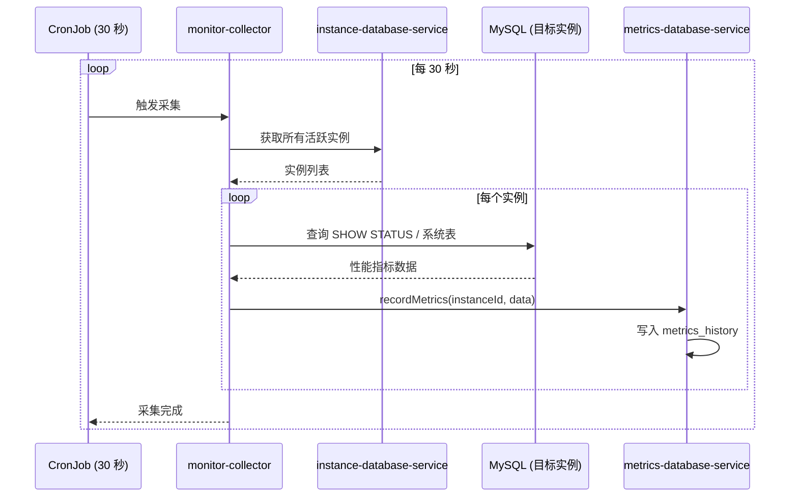
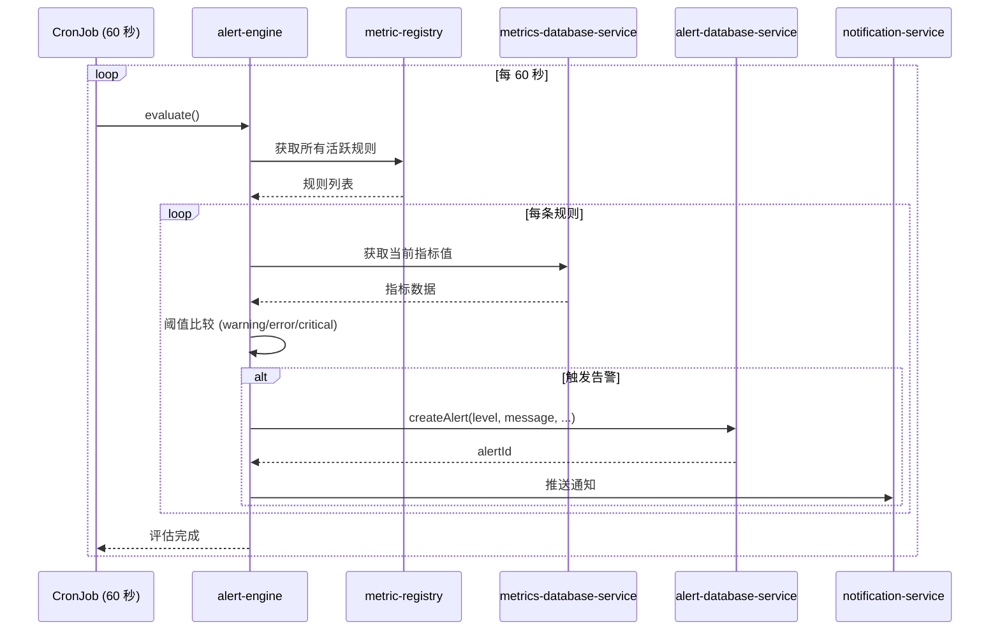

# Slide 系统架构

Slide 是一个 AI 原生的数据库运维管理平台（Database Ops Platform），基于 OpenClaw Agent 框架构建，集成 LLM 实现自动化数据库运维。平台覆盖数据库监控、告警、性能分析、SQL 审核与执行、AI 辅助故障诊断等全链路运维场景，通过 Agent 驱动的方式将 DBA 从重复性工作中释放。

Slide 的核心定位是"AI 原生的数据库运维"：Agent 自动采集数据、分析问题、给出建议，同时保持人工审批和手动控制的能力。系统由四个主要部分组成：
基于 Lit + Vite 的前端 SPA、基于 Fastify + TypeScript 的后端 API 服务器、基于 OpenClaw Gateway 的 AI Agent 运行时，以及 MySQL/Elasticsearch/Redis/MongoDB 等数据层。

## 技术栈总览

| 层 | 技术 | 版本 | 用途 |
| --- | ------ | ------ | ------ |
| 前端框架 | Lit | ^3.3.0 | Web Components 组件化框架 |
| 构建工具 | Vite | ^6.0.0 | 开发服务器与生产构建 |
| 测试框架 | Playwright + Vitest | - | E2E 测试与单元测试 |
| 可视化 | ECharts | ^5.4.0 | 仪表盘、性能图表 |
| 代码编辑器 | CodeMirror | ^6.x | SQL 控制台 |
| 后端框架 | Fastify | ^4.24.3 | HTTP API 服务器 |
| AI Gateway | OpenClaw | - | 原生 LLM 流式通信与 Agent 调度 |
| 主数据库 | MySQL 8 | mysql2 ^3.20.0 | 业务数据存储 |
| 搜索引擎 | Elasticsearch | @elastic/elasticsearch ^8.11.0 | 日志存储与分析 |
| 缓存引擎 | Redis | ioredis ^5.3.2 | 会话状态与缓存 |
| 文档数据库 | MongoDB | mongodb ^6.3.0 | 柔性数据结构存储 |
| 关系数据库（扩展） | PostgreSQL | pg ^8.20.0 | PostgreSQL 纳管支持 |
| 关系数据库（扩展） | Oracle | oracledb ^6.10.0 | Oracle 数据库纳管支持 |
| LLM SDK | Anthropic SDK | ^0.30.0 | Claude API 调用 |
| LLM SDK | OpenAI SDK | ^4.28.0 | OpenAI 兼容 API 调用 |
| 报表生成 | PDFKit | ^0.18.0 | PDF 报表生成 |
| 统计分析 | simple-statistics | ^7.8.9 | 容量预测回归计算 |
| JWT 认证 | jsonwebtoken | ^9.0.2 | 用户认证令牌 |
| 定时调度 | cron | ^4.4.0 | 采集任务、告警评估、基线计算 |
| 密码哈希 | bcrypt | ^6.0.0 | 用户密码加密存储 |

**Source:** `apps/db-ops-api/package.json` (backend deps), `frontend/package.json` (frontend deps)

## 系统架构图

## 模块职责

### 后端核心模块 (`apps/db-ops-api/src/`)

**数据库连接管理** (`db-connection.ts`)
系统数据库连接池的初始化与管理，启动时建立与 MySQL 系统库的连接，并提供连接池实例供各模块使用。

**实例管理** (`instance-database-service.ts`)
纳管数据库实例的 CRUD 操作、连接测试、状态管理和凭据安全存储。支持 MySQL、PostgreSQL、Oracle 等多类型数据库实例的统一纳管。

**认证与权限** (`auth-database-service.ts`, `auth/`)
JWT 令牌认证体系与 RBAC（基于角色的访问控制）权限模型。包含用户管理（CRUD）、角色管理、权限点分配、实例级资源访问控制。所有写操作接口通过 `verifyToken` 和 `requirePermission` 中间件进行两层权限校验。

**LLM 管理** (`llm-database-service.ts`, `llm-service.ts`, `llm/`)
LLM 提供商的配置管理与多模型切换。支持 Anthropic Claude、OpenAI 兼容接口、Ollama 本地部署等提供商。API 密钥加密存储在系统库中，启动时自动同步到 OpenClaw 配置文件。

**告警管理** (`alert-database-service.ts`, `alert-engine.ts`, `alert-*`, `alert-escalation-service.ts`, `alert-silence-service.ts`)
告警规则持久化与定时评估引擎（每 60 秒轮询）。支持 50+ 指标规则的 3 级阈值配置，告警产生后自动关联实例状态。包含告警升级规则（escalation）、静默规则（silence）、维护窗口（maintenance-window）等配套功能。

**告警事件管理** (`alert-event-service.ts`, `event-aggregator.ts`)
告警事件的完整生命周期管理：创建、分配、调查、备注、RCA 关联、关闭和事后复盘。支持事件聚合和 MTTR 指标追踪。

**指标采集** (`monitor-collector.ts`, `metrics-database-service.ts`)
按 30 秒间隔自动采集所有活跃实例的关键性能指标（连接数、QPS、TPS、CPU、内存、IO、磁盘空间等），存储到 `metrics_history` 表供分析和可视化。

**AI 分析** (`ai-agent-bridge.ts`, `ai-analysis-*.ts`, `topsql-analysis-service.ts`, `alert-rca-service.ts`, `fault-diagnosis-service.ts`)
统一的 AI 分析派发入口 `dispatchOrReuse`，通过 OpenClaw Gateway 的 `chat.send` RPC 发送分析任务。支持四种分析类型：

- **告警 RCA** — 自动分析告警根因，为 `warning`/`error`/`critical` 级别告警生成根因分析报告
- **TopSQL 分析** — 对超过 10 秒的慢查询自动触发优化建议分析
- **故障诊断** — 对不健康实例自动执行全栈诊断（每 60 秒）
- **SQL 审批** — 对 SQL 执行请求做 AI 风险评估
采用 TTL 缓存策略避免重复分析：RCA 30 分钟、故障诊断 60 分钟、TopSQL 24 小时。

**SQL 审核** (`sql-audit-service.ts`)
AI 驱动的 SQL 预执行审核服务。在执行 SQL 前，将 SQL 文本和实例上下文发送给 LLM，检测潜在风险（权限越界、数据泄露、性能风险等）并给出审批建议。

**SQL 执行引擎** (`sql-executor.ts`)
受控的 SQL 执行引擎，默认只读模式，支持参数化查询防注入。写操作需通过审批流程。支持 MySQL、PostgreSQL、Oracle 的 SQL 方言适配。

**Schema/索引管理** (`schema-*.ts`, `index-*.ts`)
表结构变更追踪（每 30 分钟自动快照 + 差异检测）、索引管理（自动采集、冗余索引检测、未使用索引检测）。

**报表系统** (`report-*.ts`)
健康检查、性能分析、慢查询、容量等报表的生成与导出。支持 PDF（PDFKit）、HTML、JSON、Markdown 格式。

**通知推送** (`notification-*.ts`, `notification-service.ts`)
多渠道通知推送：钉钉、企业微信、飞书、通用 Webhook。内置 SSRF 防护机制防止内网探测。

**基线预测** (`baseline-calculator.ts`, `capacity-predictor.ts`)
指标基线计算（每天凌晨 2 点自动执行，保留 30 天）和基于线性回归的容量趋势预测。

**Gateway 运行时** (`gateway/`)
OpenClaw Agent 的集成层，包含 10 个模块：

- `openclaw-runtime.ts` — OpenClaw 配置创建和 Agent 初始化（模型、工具集、会话配置）
- `openclaw-bridge.ts` — Agent 响应的接收与解析
- `gateway-client.ts` — Gateway `chat.send` RPC 调用封装
- `chat-methods.ts` — 聊天 API 的实现逻辑
- `config-service.ts` — `openclaw.json` 配置文件的读写与校验
- `server.ts` — Gateway HTTP/WS 服务器的启动管理
- `streaming.ts` — SSE 流式响应处理
- `protocol.ts` — Gateway 协议消息类型定义
- `error-codes.ts` — 错误码枚举
- `config-service.ts` — 配置文件 JSON5 解析与 schema 验证

**审计日志** (`audit/`)
操作审计日志记录，追踪关键操作（用户登录、权限变更、SQL 执行等）的来源和三方信息。

### 前端模块 (`frontend/src/`)

**OpenClaw 核心层** (`openclaw/ui/`)
提供基础 UI 框架：WebSocket 客户端（含自动重连）、页面路由与导航、主题系统（明/暗色切换）、国际化、本地存储和生命周期管理。124 个 TypeScript 文件。

**Slide 业务层** (`slide/`)
Slide 业务逻辑的实现：Gateway 适配器（将 OpenClaw RPC 方法映射到 Slide REST API）、业务服务层（数据库服务、告警服务、Chat 服务、LLM 服务、报表服务等）、类型定义。

**页面层** (`.views/`, `slide/pages/`)
业务功能页面，包括：

- **仪表盘** — 数据库类型分布、全库数据量趋势、实例健康状态概览
- **实例管理** — 实例 CRUD、详情、监控面板、健康评估
- **告警列表** — 告警查看、分级展示、操作处理
- **AI Chat** — 对话界面，支持数据库运维上下文问答
- **SQL 控制台** — CodeMirror 编辑器、语法高亮、自动补全、执行计划可视化
- **审批管理** — 审批列表、详情、批量操作
- **用户与 RBAC** — 用户管理、角色管理、权限配置
- **LLM 配置** — 提供商管理、模型切换、密钥配置
- **报表** — 报表查看与生成

## 核心数据流

### 用户请求流程

### AI 分析流程

### 监控采集流程

### 告警评估流程

## 外部依赖

| 依赖 | 用途 | 配置项 |
| --- | --- | --- |
| MySQL 8 | 业务数据存储（实例配置、用户、告警、指标历史） | DB_HOST, DB_PORT, DB_USER, DB_PASSWORD, DB_NAME |
| Elasticsearch 8 | 慢查询日志与历史分析数据存储 | 通过 `@elastic/elasticsearch` 连接 |
| Redis 7 | 会话缓存、热数据缓存 | 通过 `ioredis` 连接 |
| MongoDB 6 | 柔性数据结构（分析报告等） | 通过 `mongodb` driver 连接 |
| Anthropic Claude | AI 分析、Chat 会话 | ANTHROPIC_API_KEY, ANTHROPIC_MODEL |
| OpenAI 兼容 API | AI 分析备选提供商 | openai SDK 配置 |
| Ollama | 本地部署 LLM 选项 | Ollama API URL |
| OpenClaw Gateway | AI Agent 运行时、工具执行、流式通信 | ws://127.0.0.1:28789/ws |
| Node.js 22+ | 运行时环境 | .nvmrc |

## 架构决策记录

| 决策 | 方案 | 理由 | 状态 |
| --- | --- | --- | --- |
| 复用 OpenClaw Agent 框架 | 使用 OpenClaw Gateway 原生 chat.send 和 dispatchInboundMessage | 复用成熟的 Agent 会话管理、流式通信和工具执行机制，避免自建 AI 管道 | 已验证 |
| 统一 AI 派发 + TTL 缓存 | `ai-agent-bridge.ts` 的 `dispatchOrReuse` | 避免同一分析任务重复触发，减少 LLM 调用成本；RCA 30 分钟、故障诊断 60 分钟、TopSQL 24 小时 | 已验证 |
| Gateway 原生 WebSocket | 前端通过 WebSocket 与 Gateway 通信，非 REST polling | 流式响应低延迟、减少 HTTP 开销，支持实时推送 | 已验证 |
| JWT + RBAC 三层权限 | JWT 令牌 + `requirePermission` 中间件 + 实例级资源访问 | 统一的认证模式覆盖所有写接口，细粒度权限控制 | 已验证 (Phase 84) |
| 参数化查询防注入 | 使用 `mysql2` prepared statements | 在所有数据库操作中防止 SQL 注入 | 已验证 |
| CronJob 定时调度 | `cron` 库标准 crontab 语法 | 简洁的调度配置，内置时区支持 | 已验证 |
| ECharts 可视化 | ECharts ^5.4.0 | 丰富的交互能力，中文生态支持优于 Chart.js | 已验证 |
| 通知渠道 SSRF 防护 | 通知模块内置 URL 验证和 IP 限制 | 防止通知推送接口被用于内网探测 | 已验证 |
| 单文件用户手册 | USER-GUIDE.md 不拆分多文件 | 简化用户查找，减少维护成本 | 设计决策 |

---

*本文档面向技术团队和架构师，随代码变更同步更新。*
*Source: `apps/db-ops-api/server.ts`, `apps/db-ops-api/src/`, `frontend/src/`*
