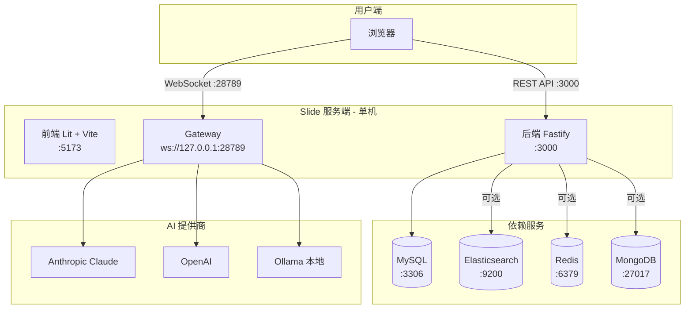

# Slide 运维文档

**版本**: v1.2
**目标读者**: 运维人员
**最后更新**: 2026-05-17

---

本文档涵盖 Slide 数据库运维平台的完整运维流程，包括系统部署、配置、启动停止、Gateway 运行机制、健康检查和故障排查。本文档适用于将 Slide 部署到开发或生产环境的运维人员。

---

## 系统概览

Slide v1.2 由多个服务组件构成，各组件通过不同的网络端口提供服务和通信。

| 组件 | 技术栈 | 端口 | 作用 |
| --- | --- | --- | --- |
| 后端 API | Fastify + TypeScript | 3000 (默认) | REST API 服务，提供所有业务接口 |
| 前端（开发） | Lit 3.3 + Vite | 5173 (默认) | 开发环境的前端热重载服务器 |
| 前端（生产） | Lit 3.3 (静态构建) | 由 Web 服务器决定 | Vite 构建后的静态文件 |
| OpenClaw Gateway | Node.js + ws | 28789 | WebSocket 服务，管理 AI Agent 消息路由和会话 |
| MySQL | MySQL 8 | 3306 | 主业务数据库 |
| Elasticsearch | ES 8 | 9200 (默认) | 日志存储和查询分析（可选） |
| Redis | Redis 7 | 6379 (默认) | 缓存和会话存储（可选） |
| MongoDB | MongoDB 7 | 27017 (默认) | 柔性数据存储（可选） |

**端口来源**: 端口通过 `.env` 文件中的 `BACKEND_PORT`（默认 3000）、`FRONTEND_PORT`（默认 5173）配置。Gateway 端口在 `server.ts` 中硬编码为 28789（见 `apps/db-ops-api/server.ts` 第 3044 行）。

---

## 部署架构

### 开发环境架构



### 生产环境架构

生产环境下建议将各组件分离部署：

- 后端 API + Gateway 部署在同一台服务器（共享 `apps/db-ops-api` 代码目录）
- 前端构建为静态文件后部署到 Nginx / CDN
- MySQL、Elasticsearch、Redis、MongoDB 各自独立部署或使用托管服务
- 生产环境必须修改默认 JWT 密钥和加密密钥

---

## 前置依赖

### 必需依赖

| 依赖 | 最低版本 | 检查命令 | 说明 |
| --- | --- | --- | --- |
| Node.js | >= 20 | `node --version` | 项目使用 tsx 直接执行 TypeScript |
| MySQL | 8.x | `mysql --version` | 主业务数据库，所有核心数据存储于此 |

### 可选依赖

| 依赖 | 最低版本 | 检查命令 | 缺失影响 |
| --- | --- | --- | --- |
| Elasticsearch | 8.x | `curl http://localhost:9200` | QAN（查询分析）和搜索不可用 |
| Redis | 7.x | `redis-cli ping` | 会话缓存和部分性能优化降级 |
| MongoDB | 7.x | `mongosh --version` | 存档相关功能不可用 |

### Node.js npm 依赖

项目使用 `tsx` 作为 TypeScript 执行器（见 `apps/db-ops-api/package.json` 中 `"dev": "tsx watch server.ts"`），无需预先编译。

---

## 配置项说明

配置文件路径: `apps/db-ops-api/.env`（基于 `.env.example` 创建）。以下按功能分组列出所有配置项。

### 数据库配置

| 配置项 | 默认值 | 必填 | 说明 |
| --- | --- | --- | --- |
| `DB_HOST` | `localhost` | 是 | MySQL 主机地址 |
| `DB_PORT` | `3306` | 是 | MySQL 端口 |
| `DB_USER` | `root` | 是 | MySQL 用户名 |
| `DB_PASSWORD` | — | 是 | MySQL 密码 |
| `DB_NAME` | `db_ops_ai` | 是 | MySQL 数据库名 |

### Redis 配置

| 配置项 | 默认值 | 必填 | 说明 |
| --- | --- | --- | --- |
| `REDIS_HOST` | `localhost` | 否 | Redis 主机地址 |
| `REDIS_PORT` | `6379` | 否 | Redis 端口 |
| `REDIS_PASSWORD` | 空 | 否 | Redis 密码 |

### Elasticsearch 配置

| 配置项 | 默认值 | 必填 | 说明 |
| --- | --- | --- | --- |
| `ELASTICSEARCH_HOST` | `localhost` | 否 | ES 主机地址 |
| `ELASTICSEARCH_PORT` | `9200` | 否 | ES 端口 |
| `ELASTICSEARCH_USERNAME` | `elastic` | 否 | ES 用户名 |
| `ELASTICSEARCH_PASSWORD` | 空 | 否 | ES 密码 |

### MongoDB 配置

| 配置项 | 默认值 | 必填 | 说明 |
| --- | --- | --- | --- |
| `MONGODB_HOST` | `localhost` | 否 | MongoDB 主机地址 |
| `MONGODB_PORT` | `27017` | 否 | MongoDB 端口 |
| `MONGODB_USERNAME` | `admin` | 否 | MongoDB 用户名 |
| `MONGODB_PASSWORD` | 空 | 否 | MongoDB 密码 |

### LLM 配置

| 配置项 | 默认值 | 必填 | 说明 |
| --- | --- | --- | --- |
| `ANTHROPIC_API_KEY` | — | 推荐 | Anthropic Claude API Key |
| `ANTHROPIC_MODEL` | `claude-sonnet-4-20250929` | 否 | Claude 模型名称 |
| `OPENAI_API_KEY` | — | 可选 | OpenAI API Key |
| `OPENAI_MODEL` | `gpt-4o` | 否 | OpenAI 模型名称 |
| `AZURE_OPENAI_API_KEY` | — | 可选 | Azure OpenAI API Key |
| `AZURE_OPENAI_ENDPOINT` | — | 可选 | Azure OpenAI 端点 |
| `AZURE_OPENAI_DEPLOYMENT` | — | 可选 | Azure OpenAI 部署名称 |
| `OLLAMA_URL` | `http://localhost:11434` | 可选 | Ollama 本地服务地址 |
| `OLLAMA_MODEL` | — | 可选 | Ollama 模型名称 |

### JWT 和加密配置

| 配置项 | 默认值 | 必填 | 说明 |
| --- | --- | --- | --- |
| `JWT_SECRET_KEY` | — | 是 | JWT 签名密钥。生产环境**必须修改**，长度至少 32 字符 |
| `JWT_EXPIRATION_MINUTES` | `1440` | 否 | JWT 令牌过期时间（分钟），默认 1440 = 24 小时 |

### 端口配置

| 配置项 | 默认值 | 必填 | 说明 |
| --- | --- | --- | --- |
| `BACKEND_PORT` | `3000` | 否 | 后端 API 服务端口 |
| `FRONTEND_PORT` | `5173` | 否 | 前端开发服务器端口 |

### AI 开关

| 配置项 | 默认值 | 必填 | 说明 |
| --- | --- | --- | --- |
| `ENABLE_AUTO_AI_ANALYSIS` | `false` | 否 | 启用后自动对告警和新慢查询触发 AI 分析（将消耗 LLM token） |

### 日志配置

| 配置项 | 默认值 | 必填 | 说明 |
| --- | --- | --- | --- |
| `LOG_LEVEL` | `INFO` | 否 | 日志级别，可选 DEBUG / INFO / WARN / ERROR |

---

## 启动流程

### 首次部署完整步骤

#### 第 1 步：确保依赖服务运行

确认 MySQL 服务已启动并可连接。可选服务（Elasticsearch、Redis、MongoDB）按需启动。

```bash
# 检查 MySQL
mysql -h localhost -u root -p -e "SELECT 1"
```

#### 第 2 步：创建并配置环境变量文件

```bash
cd apps/db-ops-api
cp .env.example .env
```

编辑 `.env`，至少配置以下项目：

- `DB_HOST`、`DB_PORT`、`DB_USER`、`DB_PASSWORD`、`DB_NAME` — 数据库连接信息
- `JWT_SECRET_KEY` — 设置一个随机字符串（至少 32 字符）
- `ANTHROPIC_API_KEY` — 如果启用 AI 功能需要配置

#### 第 3 步：安装依赖

```bash
cd apps/db-ops-api && npm install
cd frontend && npm install
```

#### 第 4 步：初始化数据库表结构

```bash
cd apps/db-ops-api && npx tsx init-db.ts
```

此命令会创建所有必需的表，包括用户表、告警规则表、实例表等。默认创建管理员账号 `admin`。

#### 第 5 步：启动后端服务

```bash
cd apps/db-ops-api && npx tsx server.ts
```

启动流程（参考 `apps/db-ops-api/server.ts`）：

1. 加载 `.env` 配置（第 4 行）
2. 设置 OpenClaw 环境变量（第 7-10 行）
3. 初始化数据库连接（第 113 行）
4. 初始化 LLM 服务（第 122 行）
5. 注册 CORS（第 125 行）
6. 注册 REST API 路由（登录、用户管理、实例管理、告警、AI 分析等 150+ 端点）
7. 启动 OpenClaw Gateway（第 3044 行，WebSocket :28789）
8. 启动监控采集（第 3052 行，30s 间隔）
9. 同步告警规则并启动告警评估（第 3058 行，60s 间隔）
10. 启动告警升级服务（第 3063 行）
11. 如果 `ENABLE_AUTO_AI_ANALYSIS=true`，启动 TopSQL 和告警 RCA 自动分析触发器（第 3073 行+）

#### 第 6 步：启动前端开发服务器

```bash
cd frontend && npm run dev
```

#### 第 7 步：访问 Web UI

浏览器访问 <http://localhost:5173>

#### 第 8 步：登录

- 用户名: `admin`
- 密码: `Tpam1234`

首次登录后建议在用户管理中修改默认密码。

---

## Gateway 运行机制

### 概述

OpenClaw Gateway 是 Slide AI 功能的核心通信层，位于前端和 AI Agent 之间，负责消息路由、会话管理和工具调用调度。

Gateway 在 `apps/db-ops-api/server.ts` 第 3044 行启动：

```typescript
const gateway = await startGatewayServer(28789, {
  host: '127.0.0.1',
  controlUiEnabled: true,
});
```

Gateway 绑定在 `ws://127.0.0.1:28789/ws`。

### WebSocket 连接生命周期

1. **连接阶段**: 客户端通过 WebSocket 协议连接到 `/ws` 端点
2. **认证阶段**: 客户端发送 `connect` 消息，携带 JWT 令牌进行身份验证（见 `apps/db-ops-api/src/gateway/server.ts`）
3. **会话创建**: 认证成功后，Gateway 为客户端创建一个会话上下文
4. **消息交换**: 客户端发送 `request` 消息（类型为 `chat`），Gateway 将消息派发给 AI Agent 处理
5. **流量推送**: Agent 回复以流式事件（`AgentEvent`、`ChatStreamEvent`）形式推送到客户端
6. **断开连接**: 客户端主动断开或超时后，Gateway 清理会话资源

### Agent 配置

Agent 配置由 `apps/db-ops-api/src/gateway/openclaw-runtime.ts` 中的 `createSlideOpenClawConfig()` 函数定义：

- **默认 Agent**: "Slide Database Assistant"
- **模型**: 默认 `anthropic/claude-sonnet-4-20250929`，可通过 `.env` 配置
- **温度**: 0.7
- **最大 Token**: 4096
- **系统提示词**: 定义 Agent 的专业领域（数据库运维、性能分析、故障诊断等）

### 工具配置

Gateway 对 Agent 可用的工具进行控制（`openclaw-runtime.ts` 第 113-117 行）：

| 配置 | 值 | 说明 |
| --- | --- | --- |
| `tools.allowlist` | `[]` | 工具白名单（空 = 不限制） |
| `tools.denylist` | `[]` | 工具黑名单（空 = 不限制） |
| `nodeHost.allowedTools` | `['read', 'write', 'edit', 'bash', 'grep', 'find', 'ls']` | 节点主机允许的工具 |

### 会话管理

- **最大历史消息数**: 100 条（`session.maxHistoryMessages`）
- **最大历史字节数**: 1MB（`session.maxHistoryBytes`）
- **技能目录**: 额外加载 `.agents/skills/` 目录下的技能

### 环境变量

| 环境变量 | 值 | 说明 |
| --- | --- | --- |
| `OPENCLAW_STATE_DIR` | `~/.openclaw-slide/` | Gateway 运行时状态目录，避免与本机安装的 OpenClaw 冲突 |
| `OPENCLAW_DISABLE_BUNDLED_PLUGINS` | `1` | 禁用 bundled 插件，由 `openclaw.json` 中的 provider 接管 |

---

## 后端组件说明

`server.ts` 启动后，以下服务并行运行：

| 组件 | 启动方式 | 间隔 | 说明 |
| --- | --- | --- | --- |
| 监控采集器 | `monitorCollector.start()` | 30 秒 | 采集所有活跃实例的性能指标 |
| 告警引擎 | `alertEngine.startEvaluationLoop()` | 60 秒 | 评估告警规则，生成告警事件 |
| 告警升级 | `alertEscalationService.start()` | cron | 根据升级规则定时检查 |
| TopSQL 自动分析 | CronJob `*/10 * * * * *` | 10 秒 | 仅当 `ENABLE_AUTO_AI_ANALYSIS=true` 时生效 |
| 告警 RCA 自动分析 | CronJob `*/10 * * * * *` | 10 秒 | 仅当 `ENABLE_AUTO_AI_ANALYSIS=true` 时生效 |
| 通知推送 | `notificationService.start()` | — | 暂不自动启动，需待通知渠道配置 UI 完善 |

---

## 启停命令

| 操作 | 命令 |
| --- | --- |
| 启动后端 | `cd apps/db-ops-api && npx tsx server.ts` |
| 启动后端（watch 模式） | `cd apps/db-ops-api && npx tsx watch server.ts` |
| 启动前端（开发） | `cd frontend && npm run dev` |
| 初始化数据库 | `cd apps/db-ops-api && npx tsx init-db.ts` |
| 停止后端 | `kill $(lsof -ti:3000)` |
| 停止前端 | `kill $(lsof -ti:5173)` |
| 停止所有 Slide 进程 | `lsof -ti:3000 \| xargs kill -9 2>/dev/null && lsof -ti:5173 \| xargs kill -9 2>/dev/null` |
| 运行后端测试 | `cd apps/db-ops-api && npm test` |
| 运行冒烟测试 | `cd apps/db-ops-api && npm run smoke` |
| 前端生产构建 | `cd frontend && npm run build` |
| 前端预览构建结果 | `cd frontend && npm run preview` |
| 启动 Gateway（独立） | `cd apps/db-ops-api && npm run gateway:start` |
| 停止 Gateway（独立） | `cd apps/db-ops-api && npm run gateway:stop` |

---

## 健康检查与日志

### 健康检查

后端 API 提供健康检查端点：

```bash
curl http://localhost:3000/api/health
```

正常返回：

```json
{"status":"ok","timestamp":"2026-05-17T00:00:00.000Z"}
```

### 日志

- 日志级别由 `.env` 中 `LOG_LEVEL` 控制，可选 `DEBUG` / `INFO` / `WARN` / `ERROR`
- 默认输出到 stdout
- 生产部署时可通过 shell 重定向保存到文件：

  ```bash
  cd apps/db-ops-api && npx tsx server.ts > /var/log/slide-api.log 2>&1
  ```

---

## 故障排查

### 常见问题

| 问题 | 可能原因 | 解决方案 |
| --- | --- | --- |
| 后端启动失败："数据库连接失败" | MySQL 未运行或 `.env` 配置错误 | 检查 MySQL 服务状态，验证 `.env` 中数据库连接信息 |
| 后端启动失败："端口被占用" | 端口 3000 已被其他进程占用 | `lsof -ti:3000 \| xargs kill -9` |
| Gateway 启动失败 | 端口 28789 被占用 | `lsof -ti:28789 \| xargs kill -9` |
| 前端白屏或接口报错 | 后端未启动或 CORS 配置错误 | 先启动后端（:3000），再启动前端（:5173） |
| 登录失败 | 密码错误或数据库未初始化 | 确认已执行 `npx tsx init-db.ts`；默认账号 admin / Tpam1234 |
| Chat AI 无响应 | LLM API Key 未配置或 Key 无效 | 检查 `.env` 中 `ANTHROPIC_API_KEY` 或 `OPENAI_API_KEY` 配置 |
| Gateway WebSocket 连接失败 | Gateway 未启动或端口错误 | 确认 server.ts 启动日志中有 "OpenClaw Gateway 已启动" |
| 告警未触发 | 告警引擎未运行或规则未配置 | 检查日志中 "告警引擎已启动"；到 UI 告警设置页检查规则 |
| 自动 AI 分析未执行 | `ENABLE_AUTO_AI_ANALYSIS` 未设为 `true` | 在 `.env` 中设置 `ENABLE_AUTO_AI_ANALYSIS=true` 并重启后端 |

### 诊断命令

```bash
# 检查端口占用
lsof -i :3000
lsof -i :5173
lsof -i :28789

# 测试 MySQL 连接
mysql -h localhost -u root -p -e "SHOW DATABASES;"

# 测试 Elasticsearch
curl http://localhost:9200

# 测试 Redis
redis-cli ping

# 查看后端日志（按日志级别过滤）
cd apps/db-ops-api && npx tsx server.ts 2>&1 | grep -i error
```

---

## 文档维护

功能变更时应同步更新本文档。PR Review 流程中应检查：

1. 新增配置项是否已添加至"配置项说明"章节
2. 新增后端服务组件是否已添加至"后端组件说明"章节
3. 端口或路径变更是否已更新"系统概览"和"启停命令"表格
4. 新增依赖服务是否已更新"前置依赖"章节
5. 常见部署问题是否已补充至"故障排查"章节

维护参考: `apps/db-ops-api/.env.example` 是配置项的权威来源；`apps/db-ops-api/server.ts` 是启动流程的权威来源。
