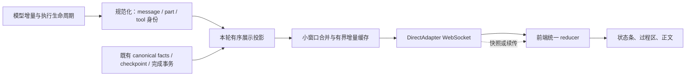

# Slide、ZCode、OpenClaw：Agent 对话流式输出对比与改进建议

评估日期：2026-10-04，Asia/Shanghai。交付类型：源码对比与设计建议。

**建议采用“先修工具事件，再打通 Message Parts 实时投影，最后完善续传与渲染”的渐进方案。** Slide 的运行时已经具备有界队列、撤回锚点、取消和完成事务；当前主要缺口在事件到界面的契约、工具过程的表达，以及实时状态与历史状态之间的一致性。不能把体验问题一概归因于 WebSocket 或没有背压。

本次确认了一处直接影响工具可见性的缺陷：后端工具事件原样送到前端，但前端消费器要求另一套字段。用当前消费器执行最小探针，原始 `tool_start` 生成工具条目 **0** 个，规范化对照事件生成 **1** 个。[S1][S2][S3]

## 1. 范围、基线与证据边界

| 项目 | 本次核对的版本 | 核对对象 |
| --- | --- | --- |
| Slide | `c3195b46c81f6855bab32ee4e5b622575d7ce031`，本地当前 HEAD | Provider 回调、ModelStep、DirectAdapter、WS writer、前端事件消费与 Markdown、Message Parts、既有流式验收文档 |
| ZCode | `29628c9acdb81b703bbd4080c207a0e7ce5e276e`，官方仓库默认分支，提交时间 2026-09-24 | SessionEvent、模型分块、流式队列、恢复 ledger、Protocol v4 publisher、前端 projection store、会话与 Markdown 渲染 |
| OpenClaw | `000cc6619c112e4c4cf0d52e456f32aacee65288`，官方仓库默认分支，提交时间 2026-10-04 | AgentEvent、Gateway 文本合并与节奏控制、工具进度、运行中快照、网页客户端、官方渠道流式文档 |

执行契约：比较文本、推理、工具、生命周期、取消、重连、背压、渲染和验收设计；提出可渐进实施的方案。验收为源码可定位、关键问题可复现、建议能映射现有模块、迁移与测试边界明确。以本报告为停止条件。

本次没有改动应用实现、运行配置或业务数据，没有启动实施任务。外部源码按 SHA 下载到临时目录只读分析。没有运行三个产品的同硬件、同模型性能对照，也没有对当前部署实例做浏览器延迟验收。因此，以下“已实现”“缺陷”指代码事实；“更适合”“预期改善”指设计判断；延迟与带宽目标是拟定验收标准，不是本次实测成绩。

硬资源预算未设定。子代理数 0、最大深度 0、代理并发峰值 1（主线程）；raw input、cached input、output 和费用实际遥测不可用。既有 MAX-103/104 报告中的测试成绩只作为历史背景，本次未重新执行或认领这些结果。[S10][S11]

## 2. 三者机制对比

| 维度 | ZCode | OpenClaw | 当前 Slide |
| --- | --- | --- | --- |
| 模型输出建模 | `text/reasoning/tool_input` 各有 start/delta/end；关联 assistantMessageId、partId、toolCallId | assistant、thinking、tool、item、run_status、lifecycle 等事件；网页与渠道投递有不同投影 | text_delta 为累计全文替换；thinking_delta 为追加；工具为独立事件，但实时协议未携带统一的 message/part 身份 |
| 工具过程 | scheduled、started、progress、result/error 有稳定 toolCallId；进度包含耗时和输出预览 | tool 事件明确包含 toolCallId、name、phase，支持 partialResult 和活动条目 | start/result 缺 toolCallId；前端要求该 ID，实际事件被丢弃；progress 也原样包在 progress 内，没有转换到消费格式 |
| 多步工作呈现 | 以 turn 内有身份的行和工作段组织正文、过程、工具，保留真实顺序 | 启动状态、工具活动、等待审批/子代理、耗时与输出计数分层反馈 | 已有思考折叠、工具卡片和文本段布局，但实时状态分散在多个变量，工具契约没有接通 |
| 增量发送与批处理 | `row.delta` 追加，受控 upsert；publisher 按订阅 profile 过滤、合并、打帧 | Gateway 对网页文本按 75ms 节奏调度，首段立即发送；有 deltaText/replace 和连接级重建 | Core 已合并相邻未消费 text delta；Adapter 仍逐次发送累计全文；前端已有 16ms 合并刷新，工具列表 80ms 刷新 |
| 重连与状态恢复 | logEpoch + seq + subscriptionId；窗口内续传，否则 snapshot；客户端检查 fromSeq/toSeq 衔接 | 运行中恢复快照包含有界过程；客户端缺文本 baseline 时触发恢复连接 | chat.watch 补发内存中的 text/thinking 替换快照；持久化 run 与历史可恢复，但快照不含工具过程或完整有序 parts |
| 模型重试与撤回 | attempt 与工具 ledger/已提交恢复锚点；显式 recovery started/discarded/blocked | 独立 lifecycle 与输出投影；有重试状态和终态收口 | 已有 attempt/sequence、checkpoint anchor、text/thinking 撤回及晚到事件拒绝；这些能力应复用 |
| 背压与慢客户端 | 模型事件队列有高水位；传输另有 ops/bytes 上限、日志保留窗及 resync 裁决 | live text 合并与慢连接投递策略；进度快照有事件数/字节界 | 模型 events/bytes 双界，ChatEvent 消费限额，每 WS 客户端独立限额与 4009 关闭；已有合理底座 |
| Markdown 流式渲染 | 使用 Streamdown 的真实 streaming 模式；完成态切 static，稳定 key，关闭正文动画 | 本报告核对网页反馈与传输；渠道另有段落、代码围栏、表格分块机制 | markdown-it + DOMPurify，对变化的全文重新解析；超过 40,000 字符降级为纯文本；已有缓存不能避免每个新前缀的解析 |

对应证据：ZCode [Z1]–[Z8]；OpenClaw [O1]–[O7]；Slide [S1]–[S11]。

**不要混淆 OpenClaw 的网页流与聊天渠道流。** 官方 streaming 文档明确说，渠道的 block streaming 是完成块的普通消息，preview streaming 是临时消息更新，渠道消息没有真正的 token-delta 流。这个结论不适用于 Gateway 到网页客户端的 assistant/chat 增量。Slide 应借鉴它的语义分层和合并边界，网页正文仍持续展示增量。[O1][O2][O3]

## 3. Slide 已确认的问题与影响

### 3.1 工具事件协议错配：最高优先级

实际链路如下：

```text
mapHookEventToChatEvent
  { type: 'tool_start', toolName, args }
        ↓ DirectAdapter 透传，附加 runId/sessionKey/sequence/attempt
handleDirectAdapterEvent
  { stream: 'tool', data: event }
        ↓ 无字段规范化
handleAgentEvent
  读取 data.toolCallId；为空立即 return
  后续还要求 data.name、data.phase
```

后端的 tool_result/tool_error 同样缺 ID；tool_progress 把业务进度放在 `event.progress`，前端却检查 `data` 顶层。因此不能只改一个字段名，也不能在前端按工具名字猜配对：同一轮可以多次或并行调用同名工具。[S1][S2][S3]

本次最小运行验证调用实际 `handleAgentEvent`，不连数据库、不执行工具：

```json
{
  "actualAdapterEventToolEntries": 0,
  "normalizedEventToolEntries": 1,
  "normalizedToolMessages": 1
}
```

对照事件为 `{toolCallId:'probe-tool-1', name:'mysql_query', phase:'start', args:{sql:'SELECT 1'}}`。执行器已有 `ToolCallRequest.id`，但返回的 `ToolEvent` 只保留 name/status/detail，身份在这条展示链路上丢失。[S5]

这证明原始事件在消费器中的丢弃行为，不代表本次测量了整个部署界面的所有工具场景。

### 3.2 生命周期不够准确：开始与完成都按批次表达

Adapter 在 `beforeExecuteTools` 里为整个工具集合发 start，在 `afterIteration` 里统一发 result/error。执行器可以把工具分成串行或并行批次。这意味着“已计划”被表达成“已开始”，已经完成的快工具也可能等慢工具结束后才收到 UI 完成通知。[S1][S5]

结果事件还使用 `ToolEvent.detail`；成功 detail 由结果转成字符串、换行压平并截取 120 字符。它是审计摘要式信息，不是结构化的结果预览。界面应能分别显示可信状态、简短结果摘要和按需详情。[S5]

### 3.3 累计全文发送放大长回答开销

`streamHolder.text += delta` 后发送整个 `streamHolder.text`，所以事件名虽然叫 text_delta，实际语义是 replace。前端依赖这一语义，不能直接把它改成追加而不升级协议。[S1][S2]

若有 n 个等长片段，每段 b 字节，忽略合并与元数据，累计替换总正文传输量为 `b × n(n+1)/2`，真正增量为 `b × n`。例如 1,000 段、每段 100 字节，是约 50.05MB 对 100KB。**这是理想化计算，不是 Slide 线上带宽实测；现有队列合并会降低帧数。** 但持续重发前缀的开销仍存在，前端 16ms 刷新不能节省已发送的网络字节。[S1][S4]

还有一个必须随修复覆盖的集成风险：工具开始时，前端把旧 chatStream 存成一段并清空；后端没有同时建立新正文段边界，下一个累计文本仍包含此前内容。仅补工具 ID 后，需要验证 `正文→工具→正文` 不重复展示前缀。[S1][S3][S7]

### 3.4 实时态、持久化态与恢复态没有使用同一投影

Slide 已有 `MessageParts`：稳定 part ID、text/reasoning/tool_call/tool_result、partial/failed/discarded/completed，以及由存储赋予的 durable 证据。数据库历史读取也有兼容转换。这不是一个需要从零新建的概念。[S6]

实时界面却主要维护 chatStream、chatThinkingText、chatStreamSegments、toolStreamById、chatToolMessages。`streamSnapshots` 只保存累计 text/thinking 与 attempt/sequence，工具运行状态和有序分块不在快照里。当前顺序检查拒绝旧 attempt 与重复 sequence，但不进行增量区间缺口恢复；现有 sequence 也明确不是持久化 cursor。[S1][S2][S3][S6][S9]

因此，已有 chat.watch、run.snapshot、历史恢复应被视为基础能力；仍缺的是“刷新后还原本轮完整工作过程”的产品契约。

### 3.5 渲染已有节流，但长内容仍会反复解析

前端已有 16ms 定时合并，不应再把“增加前端 throttle”描述成从无到有的修复。真正需要优化的是变化范围：每个变化的全文前缀都是新的 Markdown 缓存 key，解析与 DOM 更新仍可能覆盖较大内容；超过 40,000 字符还会切换纯文本呈现。[S2][S8]

这是代码层面的性能风险与确定的降级规则；实际卡顿、掉帧和滚动跳动的程度，需要浏览器 trace 验证后量化。

## 4. 借鉴点及适用边界

### 从 ZCode 采纳

1. **带身份的分块和单一投影。** 同一 message/part/tool identity 贯穿模型流、执行状态、历史和界面；避免靠字符串累积或数组下标推断顺序。[Z1][Z5]
2. **快照 + 增量 + 明确水位。** 在同一日志代际内续传，不可续传时发快照；重复、迟到和断档均有明确处置。[Z2][Z3]
3. **语义保持合并。** 相邻同块文本可以拼接，结构边界或撤回不能跨越；过滤掉中间展示事件后，完整定稿仍能收口到相同状态。[Z4]
4. **正文与工作过程各有呈现。** 保留交错顺序，把最终回答与过程详情组织成可阅读的 turn；真实 streaming 与完成态 Markdown 分开处理，稳定 key，不用动画补造速度感。[Z6][Z7]

ZCode 的模型事件写队列有 128 项高水位，但本次所读函数没有 Slide 的 events/bytes 双界；Slide 无需用较弱的队列替换已有协调器。[Z8][S4]

ZCode 恢复 ledger 支持 `during_stream/end_of_stream` 工具时机。本方案只借鉴输入生成的可见性，不引入流中提前执行数据库工具；已有完整参数校验、执行授权、结算与 checkpoint 边界继续决定是否可以执行。[Z1][S4][S5]

### 从 OpenClaw 采纳

1. **先给真实状态，再等模型正文。** 准备上下文、启动模型、等待审批或子代理可独立显示；不要强迫 LLM 生成一句“我正在处理”来填空。[O1][O5]
2. **多种流有不同节奏。** 首个文本立即展示，后续文本小窗口合并；工具输出节流，控制与终态及时收口。当前参考实现文本节奏为 75ms，exec 详细进度最小间隔为 250ms，参数只应作为参考。[O2][O4]
3. **恢复过程不只恢复回答。** 有界进度快照可保留启动、工具及其状态；缺文本基线时明确恢复，不把无基线增量硬拼上去。[O3][O6][O7]
4. **过程反馈只展示可解释信息。** 耗时、当前工具、等待审批、结果计数与公开进度，比没有依据的百分比或不断换文案更有价值。[O4][O5]

OpenClaw 的渠道分段、随机 humanDelay 和频道默认 coalesce 值不适合直接成为 Slide 网页默认策略。Slide 的运行中内存快照与数据库 durable 状态也必须继续区分；本报告不把 OpenClaw 的内存进度快照当作完整跨进程事件日志。

## 5. 三种可选方案

| 方案 | 做法 | 价值 | 限制与成本 | 建议 |
| --- | --- | --- | --- | --- |
| A：修通现有链路 | 修复工具身份与事件转换、逐工具生命周期、真实状态反馈 | 最快消除已证实的工具黑洞 | 全文传输、分散状态、恢复快照仍不足 | 作为第一阶段交付 |
| B：复用 Parts 的渐进升级 | A + 实时 parts 投影 + 增量帧 + 有界续传/完整快照 + 局部渲染 | 同时改善可见进展、效率和恢复一致性；复用现有运行时 | 需要协议协商、前后端 reducer 和历史兼容验收 | **推荐主方案** |
| C：全面事件日志重构 | 每次流事件作为 durable journal，完整替换传输/存储/运行框架 | 适合明确要求跨进程逐 token 重放的产品 | 更多数据库写入、运维与兼容成本；仍不能保证模型重现未持久化尾部 | 当前没有必要作为前置工程 |

采用 B，按 A 可独立交付的顺序推进。保留 DirectAdapter 自管理 WS，不需要引入 OpenClaw Gateway，也没有证据表明更换 WS 为 SSE 能修复本次发现的问题。

## 6. 推荐设计

### 6.1 数据流：已有事实与执行边界，统一派生展示



canonical facts、工具 execution intent、checkpoint 和完成事务继续是已持久化事实的来源。展示投影是可重建的派生状态；不另设可与业务事实冲突的工具执行账本。运行时 transient 状态用于生成期间展示，只有既有持久化确认能提升 durable 标记。

### 6.2 第一阶段协议修复

- 从 `ToolCallRequest.id` 保留 toolCallId，传到 start/progress/result/error；执行器返回的展示 ToolEvent 也保留同一 ID。不要按 toolName、数组位置或前端时间生成执行身份。
- 在唯一规范化入口转换为前端当前需要的 `name/phase/args/partialResult/result/isError`，或让前端直接消费新的 typed ToolEvent；两者选定一种，避免前后端各有隐式字段映射。
- 在实际调度/执行点发 scheduled、started、settled；模型生成工具调用、工具进入队列、开始执行、执行完成和结果持久化分别表达。完成态不因一批工具中另一工具仍运行而延迟。
- 使用浏览器可安全导入的共享协议定义，包含边界校验；不要继续手工复制后端 union 到 frontend。协议类型可以用现有 core 的纯类型出口组织，运行时校验须避开 Node 依赖，不为这项修复先建设大型共享框架。
- 同阶段建立显式正文段身份，覆盖多次同名工具、并行工具和正文交错；修复工具卡片不能引入重复正文。

### 6.3 实时 parts：追加、替换、撤回各有明确定义

以下是拟定语义，不是已实现接口：

```text
run.status        真正的准备、推理、工具执行、等待、重试、保存状态
part.start        创建稳定 messageId/partId；声明 text/reasoning/tool_input
part.append       仅追加到指定仍开放的 part
part.replace      明确替换指定 part，用于修订或恢复
part.end          本段生成结束，不等于已持久化
tool.state        toolCallId 对应的 planned/queued/running/settled 状态
tool.progress     类型化的阶段、计数、耗时或输出预览
stream.reset      原子回到已确认 anchor，撤回无效 text/reasoning/tool_input
run.terminal      completed/partial/cancelled/timed_out/failed
stream.snapshot   同一水位上的完整有界展示状态
```

`part.end` 与存储层 `MessagePart.status='completed'` 必须分开：前者表示模型不再追加，后者在当前代码中要求 durable 证据。工具“执行已结算”和“结果已持久化”也不能混成一个布尔值。[S6]

流式 tool_input 只用于显示“正在生成查询参数”；不把不完整 JSON 当成可执行入参。重试撤回时，text、reasoning 和未执行的 tool_input 必须一起复位，已确认的工具事实继续来自现有 checkpoint/intent 机制。[S4][S11]

### 6.4 展示恢复协议：独立于模型执行恢复

建议把两个问题明确分开：

- **展示恢复**：浏览器断线后补齐最新界面；不重新请求模型或执行工具。
- **执行恢复**：进程退出或 provider 失败后按既有 anchor、预算与未知结算规则决定是否续跑。

新客户端通过能力协商启用 parts stream。旧客户端继续接收累计替换语义；不能把旧 `text_delta.delta` 悄悄改成增量，也不让一个客户端同时应用两套流。

展示帧包含 `streamEpoch/runId/turnId/subscriptionId/fromSeq/toSeq`，part/tool payload 携带稳定实体 ID。`streamEpoch` 表示展示投递 authority 的代际，模型 `attempt` 表示一次模型请求，两者用途不同；新的投递水位不复用当前可选 sequence 当作 durable cursor。

处理规则：

1. 当前进程保留窗内、epoch 相同：补 `(lastSeq, currentSeq]` 的增量。
2. epoch 改变、缓存过期或客户端没有基线：下发完整快照。
3. `toSeq <= appliedSeq` 的重复帧忽略；`fromSeq !== appliedSeq` 的断档停止应用并请求恢复。合并/过滤后的帧携带区间，不能要求“每个原始事件都在 UI 出现”。
4. 快照捕获水位 W 与后续订阅注册由同一串行 authority 完成；先交付 snapshot(W)，再释放 >W 的事件，避免拉快照期间漏事件。一次 reducer 操作同时替换文本、思考、工具、状态与水位。
5. 每次重新订阅生成 subscriptionId；旧订阅和旧 epoch 的迟到帧不再更新界面。

完整快照至少包含有序 parts、工具状态/计时/结果摘要、当前 phase、运行状态、attempt、恢复锚点和持久化边界。历史正文继续分页；快照只带本轮/尾部与有界预览，较大结果通过已授权详情接口读取。

建议初始保留上限为每 active run **2,000 项或 1MiB，先到者生效**；终态后 TTL 10 分钟，同时配置进程总缓存上限。它们是待压测调参的建议值。溢出走 snapshot，不扩大无界缓存；快照本身也有字节上限和详情引用策略。保留现有慢客户端隔离及恢复入口。

进程崩溃后从 canonical/checkpoint 重建快照，未持久化尾部可丢失并明确标记；不承诺逐 token 无损跨进程恢复，也不为本方案逐 token 写 MySQL。

### 6.5 文本与渲染节奏

- 首个有效文本和重要状态立即发送；正文随后按约 **40ms** 的小窗口合并，或达到字节阈值提前发送。该值是候选默认，需实测，不照抄 ZCode 的 30/150ms 或 OpenClaw 的 75ms。
- 首个工具状态及 result/error 立即显示；频繁 progress 可按约 **150–250ms** 合并，以真实阶段/计数为准。reset、工具边界和 terminal 强制 flush，禁止跨边界合并。
- 前端保留现有批处理思路，改为统一 reducer 后按动画帧刷新 dirty parts。后台页不能只依靠 rAF 收口；reset/terminal 需立即更新逻辑状态，并可用有界定时兜底。
- 已稳定 Markdown 块缓存，更新仍增长的尾块及受影响依赖；代码围栏、列表、表格、跨块引用可能改变前文解析，不能简单按空行永久冻结。
- 完成态转稳定渲染，保留 part key 和用户展开/收起状态；代码高亮与大型结果详情延后或按需处理。保留 DOMPurify 及现有链接/HTML 边界。
- 先复用 Lit 与 markdown-it 的局部块渲染；Streamdown 是 React 组件，不直接塞进 Lit。只有实测证明现有解析器难以达到验收，再评估替换解析方案。

### 6.6 用户看到的过程

一次“分析数据库慢查询”的示例：

```text
准备诊断上下文 · 0.3 秒
正在生成查询参数
读取实例状态 · 执行中 · 1.2 秒
读取慢查询样本 · 已返回 20 条
正在分析 · 回答逐段出现
保存诊断结果
已完成 · 2 个工具 · 查看本轮过程
```

过程区与正文按实际顺序排列。当前工具显示名称、对象、耗时、真实结果计数；原始输出和长推理放在可展开详情。默认显示简洁进展与回答，完成后折叠过程，失败/等待审批保持关键提示可见。

runtime 状态由真实执行边界产生，缺少模型 reasoning 时仍有反馈。reasoning 展示仅使用模型实际提供且现有策略允许展示的内容，不要求模型额外输出内部思考。没有总量时不伪造百分比；“等待模型”与“连接断开”必须区分。连接存活信号也不能当成业务进展或重置 provider idle deadline。

用户向上阅读时暂停自动追尾，显示“有新内容”入口；断线显示“连接恢复中，服务端任务可能仍在运行”，恢复后保持阅读位置。停止按钮请求取消，直到已确认的状态到达再显示已停止；数据库工具未结算时显示待确认，不暗示事务已回滚。

新增 UI 按项目约定使用共享组件和样式 token；不在此次任务里重做整个聊天页面。

## 7. 渐进实施与验收

| 阶段 | 主要落点 | 可独立交付的行为 | 必须覆盖的验收 |
| --- | --- | --- | --- |
| P0：事件与生命周期 | core types/tool-executor、adapter/types/direct-adapter、direct-gateway/app-tool-stream | 工具过程真正可见，状态对应实际执行 | 原始 start/progress/result/error 贯穿真实消费器；同名双调用/并行不串卡；快工具先完成；正文交错不重复；取消后不误标成功 |
| P1：统一 parts 投影 | 现有 Message Parts、规范化入口、前端 reducer | 正文/思考/工具共享身份与顺序；live 与 history 形态一致 | part start/append/end/replace；仅生成结束不提升 durable；重试 reset 原子性；terminal 后晚到帧无效；兼容 legacy 历史 |
| P2：增量与恢复 | DirectAdapter 投递、chat.watch、客户端订阅与恢复 | 长回答减少前缀重发，刷新恢复完整本轮状态 | 序号缺口、重复、旧订阅、缓存淘汰；snapshot(W)+suffix 与顺序投影等价；刷新期间工具不重执行；进程重启只回到 durable 边界；新旧客户端兼容 |
| P3：渲染与测量 | markdown/grouped-render/chat-message-list/views/chat | 长内容更平稳，阅读位置稳定，可测量体验 | 代码围栏/表格/中英文碎片；40k–100k 字符；100 个工具条目；用户向上阅读；后台页返回；trace 与耗时记录 |

阶段只跑 focused checks；阶段边界跑受影响模块测试；最终候选运行一次项目规定的完整 gate。不因为本报告生成而重复全部门禁。必要时的真实付费模型验证应按实施时的授权与预算决定，不能用受控 provider 冒充真实服务质量。

以下是**拟定目标**：

| 指标 | 建议验收标准 | 测量方式与限制 |
| --- | --- | --- |
| 首次反馈 | run accepted 后 100ms 内显示实际状态 | 受控本地/固定网络 E2E；不承诺 LLM 首 token 100ms |
| 可见流式延迟 | 前台页收到正文事件到 DOM 绘制 P95 ≤100ms | 浏览器 performance 时间线；服务端排队→发送独立测量，跨设备时钟不直接相减 |
| 工具生命周期 | start/result 收到后 100ms 内更新；有真实 progress 的工具不被 UI 丢弃 | 受控工具、逐调用 ID、真实 Adapter→浏览器 E2E |
| 正文传输成本 | 固定 1,000 片段/100KB 样本，总正文载荷近线性；同样本较现状下降 ≥80% | 记录最终字节、帧数、WS 总字节；新旧相同采样条件，元数据另计 |
| 重连一致性 | 无重复正文/工具卡，工具执行计数不增加 | 真实 WS 断开、页面刷新、序号缺口与 snapshot 捕获竞态注入 |
| 冷恢复与取消 | 保持现有 anchor/intent/完成事务契约，未知结算不自动重放 | 复用并补充 MAX-104 crash/cancel/事务故障验收集 |
| 长内容渲染 | 固定浏览器硬件下，增量应用/解析自身 P95 ≤16ms，无该路径引发的 >50ms long task | 20k/40k/100k 字符、代码/表格/工具样本；记录硬件及 trace，不以动画观感代替测量 |
| 有界资源 | 模型、客户端队列、恢复缓存与单快照的 events/bytes 均不越界 | 慢 peer、多订阅、长结果、缓存淘汰压测；正常客户端仍可收到终态 |

另须覆盖 OpenAI/Anthropic/Ollama 的实际回调兼容：reasoning 缺失、thinking 先于 text、工具参数分片、空重置和 provider EOF 后 drain。流式界面完整不等于 SQL 诊断正确；业务结果正确性沿用其本身的验收。

## 8. 结论

最值得优先交付的不是打字机动画或传输技术替换，而是 **修通工具事件、准确显示每个执行阶段、用现有 Parts 统一 live/history/recovery**。再借鉴 ZCode 的增量水位和 OpenClaw 的真实状态反馈，解决长回答重复传输和刷新后过程缺失。Slide 已有的事务、背压、取消和撤回机制是这次升级的基础。

## 源码与文档索引

以下外部链接固定到本次核对的 SHA。Slide 链接指向本地当前工作区，基线以第 1 节为准。

### Slide

- [S1] DirectAdapter：模型全文累积、工具 hook 映射、WS 转发、chat.watch、streamSnapshots。
- [S2] DirectGateway：Adapter union、工具原样转发、16ms 合并、attempt/sequence 检查。
- [S3] 前端工具消费器：toolCallId/name/phase 契约、80ms 合并、文本段保存。
- [S4] ModelStep：边界 drain、tool args marker；StreamingCoordinator 的双界与合并实现见 [S4Q]。
- [S5] ToolExecutor 与 core types：执行 ID、返回摘要、串并行批次与生命周期。
- [S6] Message Parts：分块身份、status、durable；存储投影和兼容历史见 [S6D]。
- [S7] Chat view：历史、文本段、工具卡片与当前正文的组合。
- [S8] Markdown：全文缓存、解析与 40,000 字符降级规则。
- [S9] ChatEvent types：当前序号定义；每客户端限额见 [S9W]。
- [S10] MAX-103 历史流式实现与验证记录。
- [S11] MAX-104 历史撤回、锚点与崩溃恢复记录。

### ZCode

- [Z1] 事件契约与工具/分块身份；恢复 ledger 另见 [Z1R]。
- [Z2] ConversationTopicPublisher：有界日志、订阅裁决、快照与续传。
- [Z3] ConversationProjectionStore：重复、断档、订阅代际与恢复。
- [Z4] 增量协议；合并规则见 [Z4C]，profile 常量见 [Z4P]。
- [Z5] 事件规范化：live 与 cold hydration 的统一身份解释。
- [Z6] 会话正文与工作过程组织；工作段状态见 [Z6W]。
- [Z7] Markdown streaming/static 与稳定组件 key。
- [Z8] 模型事件有序队列与高水位。

### OpenClaw

- [O1] 官方 streaming 文档：网页启动反馈与渠道 block/preview 区别。
- [O2] Gateway server-chat：75ms 文本节奏、delta/replace、终态 flush。
- [O3] Gateway 客户端流式 baseline 投影；具体文本合并见 [O3M]。
- [O4] 工具进度：toolCallId、phase、partialResult、exec 250ms 节流。
- [O5] 网页工作指示：启动、审批、子代理等待、耗时、输出计数。
- [O6] 运行中进度快照：50 events/128KiB 与具体保留字段。
- [O7] 历史读取的 active-run 恢复入口；缺 baseline 的网页处置见 [O7B]。

[S1]: https://github.com/max2055/Slide/blob/c3195b46c81f6855bab32ee4e5b622575d7ce031/apps/db-ops-api/src/adapter/direct-adapter.ts#L92
[S2]: https://github.com/max2055/Slide/blob/c3195b46c81f6855bab32ee4e5b622575d7ce031/frontend/src/app/ui/direct-gateway.ts#L857
[S3]: https://github.com/max2055/Slide/blob/c3195b46c81f6855bab32ee4e5b622575d7ce031/frontend/src/app/ui/app-tool-stream.ts#L450
[S4]: https://github.com/max2055/Slide/blob/c3195b46c81f6855bab32ee4e5b622575d7ce031/packages/agent-core/src/runtime/model-step.ts#L39
[S4Q]: https://github.com/max2055/Slide/blob/c3195b46c81f6855bab32ee4e5b622575d7ce031/packages/agent-core/src/runtime/streaming-coordinator.ts#L18
[S5]: https://github.com/max2055/Slide/blob/c3195b46c81f6855bab32ee4e5b622575d7ce031/packages/agent-core/src/runtime/tool-executor.ts#L13
[S6]: https://github.com/max2055/Slide/blob/c3195b46c81f6855bab32ee4e5b622575d7ce031/packages/agent-core/src/message-parts.ts#L3
[S6D]: https://github.com/max2055/Slide/blob/c3195b46c81f6855bab32ee4e5b622575d7ce031/apps/db-ops-api/src/adapter/message-parts.ts#L1
[S7]: https://github.com/max2055/Slide/blob/c3195b46c81f6855bab32ee4e5b622575d7ce031/frontend/src/app/ui/views/chat.ts#L2084
[S8]: https://github.com/max2055/Slide/blob/c3195b46c81f6855bab32ee4e5b622575d7ce031/frontend/src/app/ui/markdown.ts#L477
[S9]: https://github.com/max2055/Slide/blob/c3195b46c81f6855bab32ee4e5b622575d7ce031/apps/db-ops-api/src/adapter/types.ts#L94
[S9W]: https://github.com/max2055/Slide/blob/c3195b46c81f6855bab32ee4e5b622575d7ce031/apps/db-ops-api/src/adapter/bounded-socket-writer.ts#L10
[S10]: https://github.com/max2055/Slide/blob/c3195b46c81f6855bab32ee4e5b622575d7ce031/docs/slide/runtime-v2/MAX-103-streaming.md
[S11]: https://github.com/max2055/Slide/blob/c3195b46c81f6855bab32ee4e5b622575d7ce031/docs/slide/runtime-v2/MAX-104-stream-boundary.md
[Z1]: https://github.com/zai-org/ZCode/blob/29628c9acdb81b703bbd4080c207a0e7ce5e276e/apps/zcode-cli/packages/contracts/src/events/session.events.ts#L694
[Z1R]: https://github.com/zai-org/ZCode/blob/29628c9acdb81b703bbd4080c207a0e7ce5e276e/apps/zcode-cli/packages/contracts/src/events/stream-recovery.events.ts
[Z2]: https://github.com/zai-org/ZCode/blob/29628c9acdb81b703bbd4080c207a0e7ce5e276e/apps/zcode-cli/packages/bootstrap/src/zcode-protocol-v4/conversation-topic-publisher.ts#L743
[Z3]: https://github.com/zai-org/ZCode/blob/29628c9acdb81b703bbd4080c207a0e7ce5e276e/packages/ui/src/v4/conversationProjectionStore.ts#L700
[Z4]: https://github.com/zai-org/ZCode/blob/29628c9acdb81b703bbd4080c207a0e7ce5e276e/packages/shared/src/zcode-protocol-v4/delta.ts
[Z4C]: https://github.com/zai-org/ZCode/blob/29628c9acdb81b703bbd4080c207a0e7ce5e276e/packages/shared/src/zcode-protocol-v4/coalesce.ts
[Z4P]: https://github.com/zai-org/ZCode/blob/29628c9acdb81b703bbd4080c207a0e7ce5e276e/packages/shared/src/zcode-protocol-v4/core.ts#L37
[Z5]: https://github.com/zai-org/ZCode/blob/29628c9acdb81b703bbd4080c207a0e7ce5e276e/apps/zcode-cli/packages/bootstrap/src/zcode-protocol-v4/event-normalizer.ts
[Z6]: https://github.com/zai-org/ZCode/blob/29628c9acdb81b703bbd4080c207a0e7ce5e276e/packages/ui/src/v4/conversationTurnFlowItems.ts
[Z6W]: https://github.com/zai-org/ZCode/blob/29628c9acdb81b703bbd4080c207a0e7ce5e276e/packages/ui/src/v4/conversationTurnWorkSegments.ts
[Z7]: https://github.com/zai-org/ZCode/blob/29628c9acdb81b703bbd4080c207a0e7ce5e276e/packages/ui/src/components/ai-elements/message.tsx#L1620
[Z8]: https://github.com/zai-org/ZCode/blob/29628c9acdb81b703bbd4080c207a0e7ce5e276e/apps/zcode-cli/packages/core/src/runtime/methods/model-streaming-event-queue.ts
[O1]: https://github.com/openclaw/openclaw/blob/000cc6619c112e4c4cf0d52e456f32aacee65288/docs/concepts/streaming.md
[O2]: https://github.com/openclaw/openclaw/blob/000cc6619c112e4c4cf0d52e456f32aacee65288/src/gateway/server-chat.ts#L700
[O3]: https://github.com/openclaw/openclaw/blob/000cc6619c112e4c4cf0d52e456f32aacee65288/packages/gateway-client/src/chat-stream-projection.ts
[O3M]: https://github.com/openclaw/openclaw/blob/000cc6619c112e4c4cf0d52e456f32aacee65288/packages/gateway-client/src/chat-stream-message.ts
[O4]: https://github.com/openclaw/openclaw/blob/000cc6619c112e4c4cf0d52e456f32aacee65288/src/agents/embedded-agent-subscribe.handlers.tools.progress.ts#L34
[O5]: https://github.com/openclaw/openclaw/blob/000cc6619c112e4c4cf0d52e456f32aacee65288/ui/src/pages/chat/components/chat-working-indicator.ts#L57
[O6]: https://github.com/openclaw/openclaw/blob/000cc6619c112e4c4cf0d52e456f32aacee65288/src/gateway/server-chat-progress-snapshot.ts
[O7]: https://github.com/openclaw/openclaw/blob/000cc6619c112e4c4cf0d52e456f32aacee65288/src/gateway/server-methods/chat-history-recovery.ts
[O7B]: https://github.com/openclaw/openclaw/blob/000cc6619c112e4c4cf0d52e456f32aacee65288/ui/src/api/gateway-chat-events.ts
