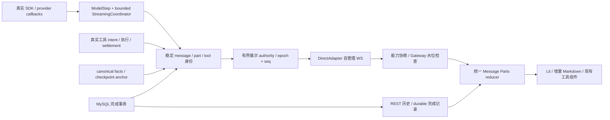

# MAX-129：流式全链路最终资格验收

2026-10-05。范围沿用父 MAX-124 的 v1 产品契约及 v2 PR/CI 续修契约。基线 `599af2040e2fcd6d05d2f252f15ebdd8d4ebe9d1`，分支 `codex/MAX-129-streaming-qualification`。S5 只交付资格证据、直接阻塞修复和一个 PR；父任务负责审查、精确 head 门禁、合并与家族关闭。付费模型质量、生产数据库/部署及无关整改不在范围。

## 合并链与证据身份

| 阶段 | 任务 / PR | 已验收 head | main merge |
| --- | --- | --- | --- |
| S1 | MAX-125 / #129 | `7fc16acc053abe48200b6f03d460044e647de6bb` | `2096fe320528537d16d193d86c70784819cd016a` |
| S2 | MAX-126 / #130 | `470b3569bd4992241326d21f3da662e6521c1d2f` | `a70de824199e9d2e013e47e5d7dc815f741230e4` |
| S3 | MAX-127 / #131 | `f2841e1b29600d4b780a6554d8db0b90176892bf` | `c0af889557cb47205b620d43a47c781148fca5ed` |
| S4 | MAX-128 / #132 | `b7403ccd49e9dde1e56ab1a5adb79957891daefe` | `599af2040e2fcd6d05d2f252f15ebdd8d4ebe9d1` |
| S5 | MAX-129 / 本文所在 PR | 当前 PR head / 附件 candidate.json | 等待父任务合并 |

前四项实际 PR 关联、MERGED、八项 SUCCESS 和 main 包含关系已核对；S5 不将“PR 已创建”计为“已合并”。完整 gate 起始候选 `3be858fa84ee35b478b2d0f0dbf45c1422cd5455`；其后仅将两项测试的 activity fixture 改为语义输出，生产代码没有变化。真实 live 指标记录执行时 head `a0030212a696980bda04b00b651738565c97a94b`。附件保存命令、退出码、源文件 SHA-256、候选/最终 head，文档提交不触发重复全量 gate。

阶段设计与原始证据入口：[S1](MAX-125-tool-stream.md)、[S2](MAX-126-message-projection.md)、[S3](MAX-127-display-stream.md)、[S4](MAX-128-rendering.md)。S4 原附件 `MAX-128-evidence-b7403ccd49e9.tar.gz`，14,597,637 bytes，SHA-256 `234b3145aa05522980c21d6f882ded517ea50cf3aef6db19d37dd44d47278778` 已复核。本次重新执行 streaming suite，另交当前源码的原始指标和 trace；旧附件保留为历史证据。

## 最终实现

展示是持久事实的派生投影。模型 attempt、展示 streamEpoch/seq 和持久 anchor/cursor 各自独立；生成结束和工具 settled 都不能提升 durable。只有既有存储 owner 成功提交才发布 persisted / terminal。参数分片只用于展示，工具仍等完整参数、权限与审批边界后执行。没有新增 Gateway 服务、WS→SSE 替换、逐 token MySQL 写入或模型框架移植。

`auth` 协商 `parts-stream-v1`；旧端继续累计替换 `text_delta.delta`。同一客户端只应用协商选中的协议。新端 `stream.snapshot` / `stream.delta` 均含 version、streamEpoch、runId、turnId、subscriptionId、fromSeq/toSeq；完整 Parts 由 browser-safe contract 校验，非法帧不推进水位。snapshot(W)、安装订阅和 suffix 排队在同一同步 authority 内完成。重复丢弃，缺口冻结后 watch，旧订阅/epoch 晚到丢弃；恢复仅订阅，不 chat.send。

reset 原子撤回未确认 text/reasoning/tool_input，保留已确认工具事实和顺序。运行中刷新恢复完整有界 parts、工具计时/状态、phase、attempt、anchor/durable；冷启动只承诺已有 durable 边界，未持久尾部允许丢失。unknown 工具结算保持待确认，恢复和回退都不自动重放副作用。

S5 修复四处验收阻塞：Anthropic 真实工具 ID 和 JSON 片段回调遗漏；OpenAI EOF 未闭合 think 尾部只进入结果、未进入展示回调；空 transport heartbeat 被误用于 idle deadline；最终业务历史剔除已确认 parts，并将同一工具结果显示成第二张卡。现在完整业务历史保留来源身份，每个工具只显示一次。UI 复用已有模板和样式，DOMPurify/链接边界、共享组件与 Lit binding 保持。

## 父任务九项验收矩阵

| 验收项 | 当前证据与边界 |
| --- | --- |
| 1. 原始工具生命周期贯穿 Adapter→Gateway→UI，重复/并行/交错/取消 | `streaming-live.spec.ts` 真实 MySQL/WS/Gateway/reducer/renderChat：100 次实际执行、100 张卡，刷新后计数不变；tool-stream / tool-stream-integration / managed Stop 保留快工具与未知结算语义。 |
| 2. 稳定 Parts 契约、撤回、durable 和终态边界 | Core/API/frontend projection tests、streaming UI 7 项、真实完成事务 qualification；part.end 不提升 durable，工具 settled 与 persisted 区分，非法/旧/终态晚到帧拒绝。 |
| 3. 能力协商、旧端累计替换、新端追加、首发/flush | 同 run 双 peer 原始 wire；display-stream 与真实 WS 测试。正文 40ms/8KiB，progress 200ms，reset/tool/terminal flush；空 heartbeat 不标 generating，不延长 idle。 |
| 4. seq/epoch/订阅、竞态、重连/刷新不重执行 | display-stream-ws 真 WS+Gateway 故障注入重复/缺口/旧订阅/淘汰/capture 竞态；live 两次浏览器导航恢复，100 SQL counter 不增加；MySQL crash 子进程验证 durable 恢复且 unknown 不重放。 |
| 5. 缓存、队列、快照与全局硬界 | display-stream / streaming-coordinator / runtime budget / bounded writer 测试；live 末态 246,290 bytes、203 ops、pending 0。慢端真实阻塞 send callback 被独立关闭，正常 peer 继续收口。 |
| 6. accepted≤100ms、paint P95≤100ms、传输减少≥80% | live accepted→waiting_model **26.3ms**，paint P95 **32.4ms**、apply P95 **1.8ms**；1000×100byte 正文 wire **下降99.4763%**，计量见下表。authority 500/1000/2000 片段继续精确线性。 |
| 7. 20k/40k/100k、SQL/列表/表格/引用、100工具、阅读/窄屏/后台 | 当前 streaming suite 7/7、audit 59/59；15组 parse/apply P95 最大 **7.2/10.3ms**，paint 最大 **35.4ms**，相关 long task 0；100工具独立 UI apply/paint P95 **4.1/34.2ms**。保存 samples、CDP/Playwright traces、截图。 |
| 8. provider shapes、故障、MAX-103/104 兼容 | 本地真实 HTTP SSE+SDK 8项：Anthropic 无/有thinking、OpenAI/Ollama-compatible无reasoning/JSON分片/EOF、空heartbeat；既有空reset、drain/abort/timeout/anchor tests；真实 MySQL runtime、审批、completion pending、crash、managed保存失败/length/reject/Stop。受控 provider/auth 与真实登录验收分开。 |
| 9. 五项合并、当前CI与最终文档 | 前四项已合并；本PR当前head八项 CI 以 GitHub/Multica 快照及最终交付为准。S5合并、main包含第五项merge、家族无失败/冲突及关闭规则由 MAX-124 完成，当前不提前宣称。 |

## 测量与性能

Apple M5 /10核 /24GiB，darwin 27.0.0，Node 24.18.0、pnpm 11.19.0，MySQL 8.4、Chromium 148.0.7778.96。浏览器使用 Desktop Chrome 模拟 UA，实际主机是 macOS。live 每片100bytes，共1000片段/100KB，片间 setImmediate；工具分十批，每批十个并行、真实 SELECT 1，加隔离表唯一计数，第100个暂停供刷新。provider 和 actor auth 是受控 fixture，WS、真实 Fastify REST 历史/数据库事务、Gateway/reducer/renderChat 和浏览器是真实路径。managed 用例另经真实登录/JWT/UI/WS 运行。

传输比较使用同 run 在第100个工具暂停、第一次刷新前的同一边界，收录原连接全部订阅（admission 会替换 idle watch 订阅）。正文为 delta/partText/finalContent/thinkingContent/text/content 字段的 JSON 编码 bytes，含确认快照/预览；总量按实际序列化JSON + 每帧14bytes的保守 WS 上界，元数据为差值。不是抓包层的 TCP/TLS 字节。首轮仅取 idle subscription 得到零正文，已判定无效并修正统计；以下仅使用修正后数据。

| 同边界模式 | 正文 bytes | JSON bytes | WS bytes上界 | 元数据/帧 bytes上界 | 帧 |
| --- | ---: | ---: | ---: | ---: | ---: |
| legacy | 102,075,034 | 104,034,617 | 104,057,857 | 1,982,823 | 1660 |
| parts | 534,563 | 1,525,323 | 1,534,941 | 1,000,378 | 687 |

正文下降99.4763%；增量仍会在 checkpoint/持久确认发送有界快照，不承诺正文只发送一次。含两次刷新和完成收口的现代端合计708帧/2,330,777 WS bytes上界（正文867,589），legacy1680帧/105,161,704 WS bytes上界。刷新流量单列，不混入主比较。

浏览器时延使用同一 `performance.now()`；两个rAF作为经过中间paint的保守上界，不跨Node/浏览器时钟相减。parse/apply/LongTask 使用现有S4方法；mixed/plain/fence/list/table ×20k/40k/100k，mixed parser100字符一批，其他1000字符，DOM apply1000字符。原始15组数据和trace在证据包，精简实测数据见 [MAX-129-performance.json](MAX-129-performance.json)，对比报告更新见 [MAX-129-streaming-comparison.md](MAX-129-streaming-comparison.md)。旧renderer超过40k降级纯文本，因此100k旧值较小并不代表等价Markdown更快；不做三个产品同硬件/同模型性能排名。

## 配置、灰度与安全回退

完整约束见 [S3配置表](MAX-127-display-stream.md)。`SLIDE_PARTS_STREAM_ENABLED=false` 关闭新连接capability，新端回到legacy；未请求capability的旧端自然保持legacy。模式在连接auth时确定，展示limits在authority构造时冻结；每个新run在已部署实例策略下执行，不能通过运行中修改环境变量让既有帧/缓存切换语义。

| 环境变量（SLIDE_STREAM_前缀） | 默认值 |
| --- | ---: |
| MAX_RUN_OPS / MAX_RUN_BYTES | 2000 /1048576 |
| MAX_RUNS / MAX_GLOBAL_OPS / MAX_GLOBAL_BYTES | 64 /16000 /16777216 |
| MAX_SNAPSHOT_PARTS / MAX_SNAPSHOT_BYTES | 256 /262144 |
| MAX_SUBSCRIPTIONS_PER_PEER / TERMINAL_TTL_MS | 8 /600000 |
| TEXT_WINDOW_MS / TEXT_BATCH_BYTES / PROGRESS_WINDOW_MS | 40 /8192 /200 |

这些是实际环境变量，不是仅能从constructor传值。配置必须为正安全整数，snapshot至少8192bytes、run≥snapshot两倍、global≥单run、batch≤snapshot一半；非法启动失败。前端投影/水位最多64 runs、8订阅；既有client bounded writer和模型coordinator预算独立保留。超界snapshot保留尾部并标 truncated/omittedParts，详情引用走既有授权历史；TTL/淘汰不删除持久事实。

灰度建议先在开发/预发实例以新连接启用capability，核对auth响应、sequence gap/resnapshot、4009、display authority stats、idle原因码、completion pending和唯一写入；稳定后扩大新连接比例。项目没有新增集中指标平台或自动灰度控制器，authority.stats()是实际可调用诊断入口，本文步骤未在生产执行。

回退时先停止该实例接受新run，等待现有run完成及工具provider实际settlement；未能结算的副作用按unknown处理、保留intent/anchor和完成pending。再设置false并重启API/重新连接，验证legacy累计替换、历史/完成事务仍可读。灰度部署必须保留新run的固定版本与策略，不能把旧版本直接接管未结算工具当作可重试工作。恢复checkpoint/历史只恢复展示与既有durable事实，不自动调用chat.send。

协议开关不关闭增量Markdown；需要代码回退时由部署流程回退S5/S4对应代码，保留additive message parts、工具事实和数据库完成ledger，禁止删库或重放业务。现有发布回滚drill只验证artifact校验和及原子目录切换，不计作生产部署或数据回滚验收。

## 验证记录与限制

最终一次完整gate记录在附件 `gate/results.json` 与每项日志。`pnpm -r test`先遇到旧heartbeat预期冲突，sandbox22 passed/4 existing skipped、frontend604 passed；Core修正语义fixture后完整675 passed。API首轮LONG_CHAT仍以onActivity维持idle，改为真实content callback，按受影响API模块重验：323文件、3048 passed /251 existing skipped。没有放宽时限、阈值或skip；Core仍同时验证真实输出受wall-clock约束与空heartbeat触发idle。

四模块typecheck、lint、build/CSP、contracts、matrix37/37、security audit/scan、audit59、streaming7、live1、deterministic/MySQL runtime、managed security/cron/runtime、全部CI recovery脚本和release/rollback全部通过，具体命令和退出码见附件。managed security 4/4、Cron 1/1、runtime 3/3；MySQL审批14/14；发布包14,324,492bytes，校验与原子回滚drill通过。既有环境型251 API及4 sandbox skipped不算真实资格通过，真实MySQL脚本提供独立覆盖；既有lint和bundle-size warnings保留。当前CI仍单独要求八项SUCCESS，不用本地通过代替。

开发首轮100个工具在同一批突发发送使既有128帧writer触发4009；保留硬界，没有提高限额。最终真实100工具样本采用10×10批次，并发部分仍是真实执行；不声称单批100或任意巨大突发在慢peer上均能不中断。连接断开不取消服务端工具，watch恢复不增加counter。

受控SSE可证明SDK callback shapes，Ollama采用项目实际OpenAI-compatible接口；未启动真实Ollama模型，也未调用付费业务provider。没有验证任意输入/硬件、跨机器/TLS网络、30分钟soak、LLM质量或生产rollout；不承诺LLM首token≤100ms。原始失败日志保留以解释修复，失败轮次不计为通过。

证据包包含candidate/source hashes、命令/环境/退出码、wire原始事件、samples、CDP/Playwright traces和截图；tar及校验和统一outputs，逐个实际size<300,000,000bytes。Git不收录大trace。测试临时schema、容器和本run服务收尾清理；既有工作树用户AGENTS.md/.multica修改未提交或回滚。

CI持久条件规则 `01a10a16-334a-7d0e-8232-4a2ceaed337f`，continuous/max-fires1000，有效至2026-10-12T03:23:09.512261Z；每次push前及退出前核对enabled、未暂停、未过期和精确head检查。本任务不重复create规则、不merge/done，成功in_review交父MAX-124。

硬预算未设定。raw input/cached input/output、标准化实际吞吐和费用遥测不可用；未用Goal内部计数或active零值冒充实测。新增子代理0、最大深度0、实施代理并发峰值1；父巡检可独立运行，家族上限2。
