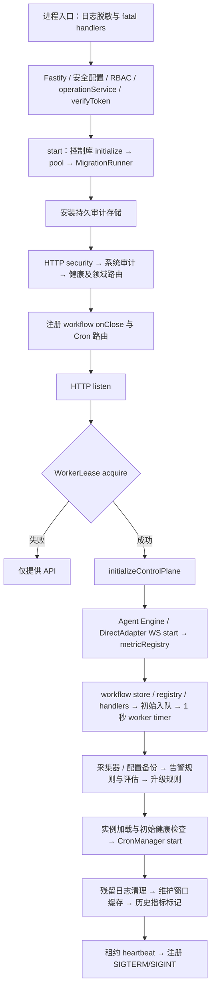
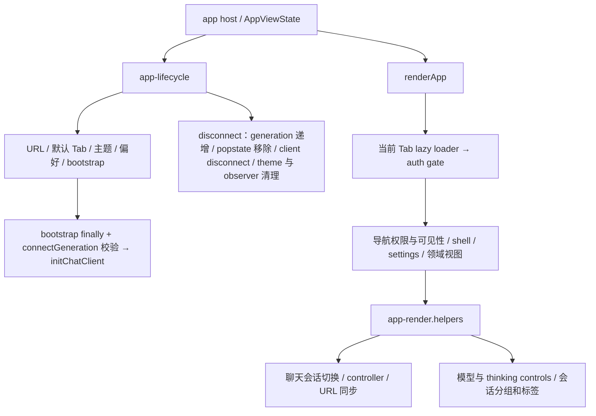

# MAX-61 分阶段装配拆分方案

状态：设计候选，待批准首批；未实施运行时代码。复核日期：2026-09-17。

## 执行契约 v1

目标：盘点当前后端 composition、routes、lifecycle 与前端视图装配，选择一块行为不变且可独立验证的首批。
首批推荐仅提取健康路由；后续批次只登记，不以技术债名义扩张。
排除：UI 改版、Cron/Worker 语义修复、数据库迁移、统一依赖注入框架、全量路由迁移、部署。
硬预算未设定；子代理 0，深度 0；实际 token、缓存 token 和费用遥测不可用，不作虚构估算。
停止条件：设计批准前不实施；实施中发现必须改变权限、响应或启动关闭语义时，保留证据并重新冻结范围。

## 基线复核

已执行 `git fetch origin main`，以 `099b2062b80de25087015dd636efe70ee85de5d7` 的 Git 对象为依据，而非旧工作树源码。
原审计基线为 `45259c040788239035126014a53bb695ee878f64`。当前工作树的 `AGENTS.md` 和 `.multica/` 已有修改，未改动。

| 文件 | 最新 main 字节数 | 行数 |
| --- | ---: | ---: |
| apps/db-ops-api/server.ts | 254669 | 5692 |
| frontend/src/app/ui/app-render.helpers.ts | 39298 | 1201 |
| frontend/src/app/ui/app-render.ts | 37177 | 906 |

当前 main 已有 `registerCronRoutes`、`registerNotificationHandlers`，以及反馈、聊天、实例列表、资源、审计、安全等领域路由注册器。不能重复搬迁这些工作。文件大小不构成 Cron/Worker 缺陷的因果证据。

## 后端现有依赖和顺序

下图表示源码调用顺序及所有权，不表示已经通过真实服务启动测试。

`initializeControlPlane` 的实际顺序：安全策略 → 预定义技能（失败警告）→ prompt 初始化及可选 watcher → session cleanup → LLM 初始化 → active 实例重连（按实例及整体捕获异常）→ refresh token 清理。它在源码较前处定义，但只在 listen 和租约成功后执行，不能按文本位置提前调用。

关闭顺序（`server.ts:5662`）：防重入 → 清 heartbeat、workflow timer → 等待 workflow shutdown（超时记录）→ monitor/network stop → await config backup stop → alert evaluation/escalation stop → session cleanup stop → prompt watcher stop → await Cron stop → await Engine dispose → lease release → Fastify close → DB close。Fastify `onClose` 另会清 workflow timer 并调用 shutdown。首批不整理这两条清理路径。

关键跨域依赖：`notificationWorkflowStore` 在 Worker 就绪后赋值，供 API 使用；Cron 路由使用 getter 取得后初始化的 manager；workflow handlers 同时依赖报告、通知、容量和告警服务；审批 operation callbacks 依赖持久 operationService 与 approvalService。因此不把上述闭包整体搬成泛型容器。

需保留的现状：未获得租约的分支只有 API；信号处理器在 startWorkers 成功后安装；维护窗口启动与当前 shutdown 列表不对称。这些只是源码观察，未判定为本任务确认缺陷，首批不修复、不借此扩大范围。

## 前端现有依赖

`app-render.ts` 同时持有 eager component 注册、lazy loader 缓存、宿主刷新回调、登录门、导航和领域事件绑定；不得贸然将 lazy loading 改为 eager loading。`app-render.helpers.ts` 同时承担 UI 和 session 状态变更；会话解析/分组是较窄的未来候选。已有 `navigation.ts`、`chat/session-controls.ts`、`app-settings.ts` 和 `app-lifecycle.ts` 应继续复用。首批不改前端，因此现有入口、权限可见性、属性绑定和加载顺序均保持原样。

## 方案取舍与候选顺序

| 方案 | 收益与代价 | 决定 |
| --- | --- | --- |
| A：提取四个健康路由 | 边界小，无 timer 和 Worker 依赖；可用 inject 验证真实路由契约；减小体积有限 | 推荐首批 |
| B：先提取 workflow 或 lifecycle | 可减少更多装配，但牵涉租约、abort、shutdown、延迟赋值和多服务副作用 | 后续独立冻结 |
| C：先拆前端 shell/聊天装配 | 可减少视图耦合，但需验证动态加载、会话和导航行为，状态接口较大 | 后续独立冻结 |

后续顺序建议：健康路由 → 另一个具备请求级测试的独立领域路由 → 前端纯会话标签/分组 → workflow job 注册 → 最后启动关闭。每批只有在独立验收成立后才进入下一批，不自动创建或启动外部任务。

## 最小首批设计

新增 `apps/db-ops-api/src/health-routes.ts`，导出 `registerHealthRoutes(fastify, verifyToken, checker = consistencyChecker)`，checker 类型收窄为现有服务的 `healthOverview`。遵循 `feedback-routes.ts` 的注册器和可注入服务模式；复用 `requirePermission`、`HealthResponseSchema`，不新建通用路由框架。

只把以下四条路由从 `server.ts:299` 起迁出；调用仍放在 HTTP security、system audit 之后，collect-capacity 之前。同步注册即可，不新增 Fastify plugin 封装作用域。

| 路由 | 不变契约 |
| --- | --- |
| GET /api/health | 公开；原 response schema；status=ok、ISO timestamp |
| GET /api/health/overview | verifyToken → config:view；完整共享快照 |
| GET /api/health/consistency | 同上；排除 truth，保留其余快照字段 |
| GET /api/health/readiness | 同上；返回 truth |

三个详细接口均保持 `refresh === 'true'` 的严格比较、单次调用 `healthOverview`、异常时 500 和原 `{ error: err.message }`。不更改错误脱敏策略、缓存和服务实现。`server.ts` 仍在其他业务使用 consistencyChecker 时必须保留其导入。

预期代码修改仅为 server 导入与调用、新增 health-routes.ts、改写 health-routes.test.ts；若契约扫描按 server.ts 文本匹配，先查证再仅调整健康路由的扫描输入，不削弱断言。

## 验收和验证方案

当前 `src/health-routes.test.ts` 只匹配 server.ts 文本，提取后会误失败；需改为 Fastify inject 行为测试，不只改正则路径。

1. 公开 health 无 token 可达，200/schema/status/timestamp 正确；注册模块不会打开端口或启动后台任务。
2. 使用真实认证与权限 middleware（依赖按已有 auth 测试模式隔离）验证三个详细接口：无效或缺失 token 401、已认证缺 config:view 403、获授权 200；拒绝时 checker 不被调用。不得只用永远放行的 stub 宣称权限回归通过。
3. 以固定快照验证 overview 完整响应、consistency 不泄漏 truth、readiness 只返回 truth；对缺省、true、false 和非 true 值验证 refresh 参数；checker 抛错时逐接口验证 500 响应。
4. 保留健康路由注册相对位置；代码 diff 核对 startWorkers、listen、onClose、signals、租约与所有 frontend 文件零变更。
5. 开发 focused：`pnpm --filter slide-api exec vitest run src/health-routes.test.ts`。
6. 阶段相关回归：健康路由及 `src/security/http-security.test.ts`、`src/auth/require-permission.test.ts`（实施前核实测试路径，若目录变化使用实际对应文件）。
7. 最终候选一次 gate：`pnpm --filter slide-api test`、`pnpm --filter slide-api typecheck`、`pnpm --filter slide-frontend typecheck`、`pnpm build`、`pnpm contracts:check`、`git diff --check`。后端无独立 build script，用其 typecheck；前端 build 同时执行 CSP 检查。不将未执行项写成通过。
8. 无关既有或环境失败单独分类记录；相关失败修复后只重跑受影响检查。若额外触及生命周期，停止并重新定义真实启动/关闭验证，不用单元测试冒充进程级验证。

回滚：首批运行时代码及其测试作为一个独立 commit，设计文档单独 commit；不含 migration 和配置修改，可单独 revert 首批代码 commit。实施前再次 fetch 最新 main 并核对该边界，避免覆盖并行工作。

## 本次证据与交付状态

已完成：Issue 与全部根评论扫描（无评论）、最新 main fetch、Git 对象源码盘点、现有注册器/健康测试与 package scripts 核对、以上设计自审。未启动服务、未修改运行时代码、未运行运行时测试/类型检查/构建，故 Issue 验收 2、3 尚未完成。

待批准事项仅为首批 A：按此方案提取四个健康路由并执行验证；B/C 及后续批次不在批准范围内。设计审批来源为 brainstorming 技能的显式 HARD-GATE，不是技术债任务新增的通用审批要求。

## 执行契约 v2 与 A 实施结果（2026-09-17）

Max 已批准 A。v1 保留为历史设计；批准后的代码基线为 main@099b206，使用独立工作树，未包含原工作树已有改动。
A 按原边界完成：健康路由注册器、原位置调用和 inject 行为测试。未变更生命周期、Worker 或前端。
B/C 在 MAX-61 正文的独立待办持续跟踪，批准前保持候选；启动前冻结小批范围和验收，获批后创建关联实施子任务。B/C 不阻塞 A 验收。

验证：定向 44 项通过；后端全量 259 文件通过、4 跳过，2208 项通过、55 跳过；前后端类型检查、前端构建及 CSP、contracts:check 和 diff 检查通过。构建有既有大 chunk 提示。
未启动真实数据库服务；生命周期保持不变依据限定代码 diff，健康路由行为由 Fastify inject 验证。
硬预算未设定，累计子代理 0；实际 token/费用遥测不可用。
